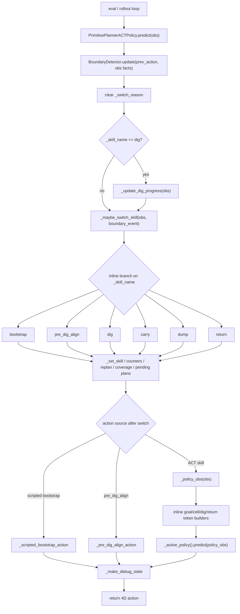
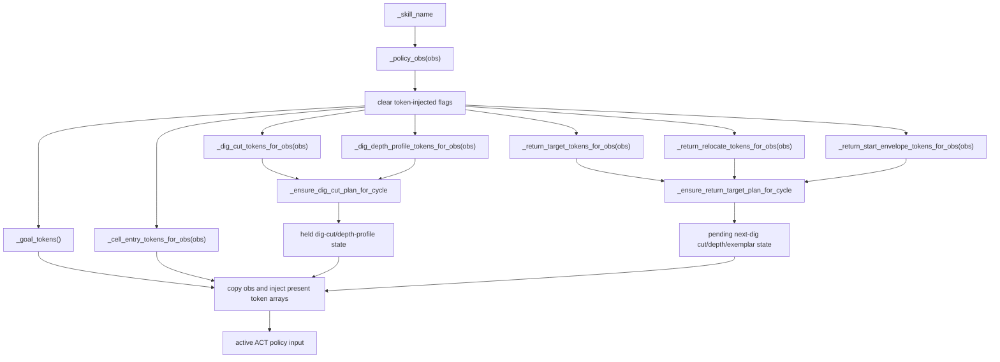

# Planner Baseline Architecture Map

Status: corrected first-round reconstruction from the branch-created baseline.
This is an architecture map and target-direction note, not a migration record.

Branch-created baseline:
`152350e3ed9a8816ca8d685195fc8f297ab3fcec`
(`152350e docs: update v2.4.5 planning guidance`).

In this document, "branch baseline" means this branch-created baseline, not a
later remote tracking ref or pushed checkpoint.

Local evidence:

- `git reflog show fs/v2_4-refactor-tests` records
  `branch: Created from tx/2_4-YuLong_Planner` at `152350e` on
  2026-06-04 13:09:01 +0800.
- The checked-out branch during this audit was `fs/v2_4-refactor-tests`.
- Local HEAD was `e306eb3 Require baseline architecture reconstruction`, which
  is later exploration history and not the architecture source of truth.
- `origin/fs/v2_4-refactor-tests` at `f004d5a` is only a later pushed ref. It is
  not the branch-created baseline requested for this reconstruction.

Do not record round-by-round changes here. Append execution records to
`docs/planner_rollout_evidence_refactor_log.md`.

## Purpose

This file prevents future refactor rounds from using the current partially
refactored stack as the architecture source of truth. Each live migration should
start from the branch-created planner shape at `152350e`, then overlay real
rollout evidence before choosing a code path to migrate.

This first round is code understanding only:

- no planner runtime code was changed
- no behavior was migrated
- no code was deleted
- no confirmed-live migration slice was selected
- no rollout evidence packet was bound to a migration candidate

## Baseline Code Shape

At `152350e`, the primitive planner is still a single large inline planner:

- `testbed/policies/hybrid/primitive_planner.py` has 6516 lines.
- `PrimitivePlannerACTPolicy` directly inherits `Policy`.
- There is no `DigCoverageMixin`, `PlannerBlackboard`,
  `PlannerConditioningState`, `PlannerTickContext`, `LegacyStateMachineBackend`,
  behavior-tree runtime backend, or backend effect boundary.
- The 4P planner and the 5P compatibility planner live in the same file.

This baseline is therefore the right place to understand the original
responsibility pile-up before deciding what to keep, extract, reclassify, or
delete later.

## Baseline Entry Flow

The default 4P path is one public adapter plus an inline finite-state machine.
`predict()` updates event facts, runs `_maybe_switch_skill()`, dispatches the
current action source, and then rebuilds public debug state.

## Baseline Facts

These references are from branch-created baseline file
`testbed/policies/hybrid/primitive_planner.py` at `152350e`.

- `class PrimitivePlannerACTPolicy`: line 149.
- `__init__`: lines 157-841. Constructs policy adapters, boundary detector
  config, switch thresholds, dig-cut planner config, return-target config,
  coverage config, bootstrap config, and pre-dig-align config directly on the
  policy adapter.
- `reset`: lines 842-967. Resets all low-level policies, boundary detector,
  active skill, lifecycle counters, token state, return-target state,
  pending-dig state, coverage state, and debug state.
- `predict`: lines 968-1012. Updates boundary event, clears switch reason,
  updates dig progress, runs `_maybe_switch_skill()`, dispatches action, updates
  `_prev_action`, and rebuilds debug state.
- `debug_state`: line 1014. Builds a public debug dictionary inline from
  planner fields, token flags, coverage fields, and handoff facts.
- `rollout_summary`: line 1390. Builds rollout summary inline from planner
  counters, token state, coverage state, and selected debug fields.
- `planner_trace`: line 1495. Builds trace output inline.
- `_maybe_switch_skill`: line 1550. Owns the inline FSM branch order and most
  transition side effects for the 4P path.
- `_set_skill`: line 1820. Owns active-skill mutation, switch reason,
  low-level policy reset timing, hold counter resets, return state reset,
  dig-entry reset, and dig-cut plan clearing.
- `_policy_obs`: line 3193. Resets token-injected flags, builds optional token
  arrays, injects them into a copy of `obs`, and returns the low-level policy
  observation.
- `_ensure_return_target_plan_for_cycle`: line 3264. Builds return-target,
  return-start-envelope, pending next-dig cut, and pending depth-profile state.
- `_ensure_dig_cut_plan_for_cycle`: line 3351. Builds held dig-cut and
  dig-depth-profile tokens for the active cycle.
- `_build_next_dig_cut_plan_for_return`: line 3628. Combines return planning,
  coverage activation, conservative fallback, operator prior, and pending
  next-dig state.
- `_active_policy`: line 5994. Maps active skill to bootstrap, first-dig, dig,
  carry, dump, or return low-level ACT policy.
- `class PrimitivePlannerACT5PPolicy`: line 6091. Compatibility subclass with
  `approach_dump` and `dump_release` states; it overrides `_maybe_switch_skill`,
  `_set_skill`, and `_active_policy`.

Related baseline files:

- `testbed/planner/boundary_detector.py`: semantic boundary events consumed by
  the inline FSM.
- `testbed/data/dig_depth_profile_v2_4.py`: depth-profile data helpers.
- `testbed/configs/planner_priors/*.json`: operator/removed-depth priors.
- `testbed/runtime/_eval.py`: eval/runtime policy construction and config
  orchestration.

## Inline FSM Shape

The baseline state machine is not a service object. It is a single method that
branches on `_skill_name` and mutates planner fields directly.

| Skill | Branch reads | Branch side effects |
| --- | --- | --- |
| `bootstrap` | `_should_end_bootstrap()`, bootstrap mode, pre-dig-align enabled | `_set_skill(next_skill, bootstrap_to_*)` |
| `pre_dig_align` | surface guard, alignment readiness, timeout gates | complete count, coverage reject, restart/replan, or `_set_skill("dig", reason)` |
| `dig` | exit guard, bad replan, complete-low-payload, dig-to-carry gate | coverage reject/restart on failed dig; cell-entry and coverage completion; `_set_skill("carry", dig_to_carry_*)` |
| `carry` | release safety, boundary events, dump-ready geometry/hold count | coverage dump completion; return/direct handoff; dump-start mass; `_set_skill("dump", carry_to_dump_*)` |
| `dump` | dump boundary events, dump-done geometry/hold count | coverage dump completion; return/direct handoff |
| `return` | handoff gate, next-dig boundary event, direct handoff, shallow guard | transition/cycle counters; `_set_skill(pre_dig_align or dig, return_to_*)` |

Important baseline implication: branch order, reason strings, counter timing,
policy reset timing, and token clearing all live in the policy adapter. Any
future extraction must either preserve those semantics exactly or get explicit
semantic confirmation before changing them.

## State Ownership

### Adapter State

`PrimitivePlannerACTPolicy` owns almost all runtime state at this baseline:

- public `Policy.predict`, `reset`, `debug_state`, `rollout_summary`, and
  `planner_trace`
- active skill and switch reason
- transition counters, cycle counter, return step counter, dump hold counters
- pre-dig-align counters, target qpos, error fields, surface guard state, and
  timeout handoff reason
- dig progress, best mass, plateau count, failed-dig counters, and dig-to-carry
  reason
- token arrays and injection flags for goal/cell/dig-cut/depth-profile/return
  conditioning
- return target, return relocate, return-start-envelope, and pending next-dig
  conditioning state
- coverage corridor state, active/rejected exemplar state, candidate scores,
  decision trace, and terminal-stop fields
- low-level ACT policy reset timing and dispatch
- debug/trace/summary schema assembly timing

### Boundary Detector

`BoundaryDetector` owns event extraction from previous action plus observation
facts. The planner consumes events such as dump boundary events and next-dig
entry signals, but the inline FSM decides what those events mean for skill
switching.

### Policy Boundary

The low-level ACT policies consume the assembled `policy_obs` and return a
4D action. They should not own task-level handoff, coverage, replan, token
injection, or cycle semantics.

### Data And Contract Boundary

Token dimensions, env-state indices, low-dimensional keys, HDF5 schema, and
dataset semantics should remain in data/contract modules or config source of
truth. The baseline planner currently uses these facts directly in many places;
future refactors should centralize duplicated semantic facts before moving
callers.

## Token And Data Flow

At `152350e`, token assembly is inline. There is no
`PolicyObservationAssembler`.

Important baseline implications:

- The planner decides when token groups are injected by checking active skill,
  feature flags, bootstrap policy presence, hold-until-exit flags, coverage
  terminal-stop state, and return-target planner state.
- Return planning can prepare pending next-dig cut/depth state while active
  skill is `return`.
- Dig-cut planning combines operator priors, coverage activation, conservative
  fallback, return-target reuse, raw-field debug state, and depth-profile token
  selection inside the same policy file.
- Token injection flags are part of the public debug/summary surface and must
  not change silently.

## Coverage And Return Flow

Coverage is inline planner state at this baseline, not a separate service
object. The planner stores corridor state, selected corridor ids, payload/deposit
progress, state exemplars, candidate scores, decision traces, and terminal-stop
requests on `self`.

Return-target planning and coverage are tightly coupled:

- `_build_next_dig_cut_plan_for_return()` may select or activate a coverage
  corridor for the next dig.
- `_ensure_return_target_plan_for_cycle()` writes return-target tokens,
  return-start-envelope tokens, pending dig-cut raw fields, pending dig-cut
  tokens, pending depth-profile tokens, and pending exemplar fields.
- dig-to-carry success completes cell-entry and coverage dig state.
- carry/dump-to-return paths complete coverage dump state before entering return
  or direct handoff.
- pre-dig-align and failed-dig paths can reject active coverage corridors and
  restart or replan.

These are real coupled responsibilities in the baseline. Splitting them later
should be evidence-backed and should avoid creating pass-through wrappers that
only hide the same coupling.

## Debug Trace And Rollout Flow

Public outputs are inline compatibility schemas:

- `debug_state()` returns a large dictionary with skill, switch reason,
  checkpoint, transition flags, cycle/hold counters, pre-dig-align fields,
  coverage fields, token-source fields, and handoff facts.
- `rollout_summary()` returns aggregate cycle, transition, coverage, token, and
  terminal-stop metrics.
- `planner_trace()` returns trace and coverage-decision details.

These schemas are user-visible rollout/eval contracts. Future migrations must
lock field names, defaults, and reason strings before changing implementation
ownership.

## 5P Compatibility Path

`PrimitivePlannerACT5PPolicy` is a subclass in the same file. It changes the
skill set to `dig`, `carry`, `approach_dump`, `dump_release`, and `return`, and
overrides the transition and active-policy mapping. It should be treated as a
compatibility or separate evidence candidate, not merged into the 4P target
architecture by default.

## Evidence Overlay

No rollout evidence packet was selected in this first-round audit. Therefore no
baseline code path is promoted to `confirmed-live` by this document alone.

Before any migration slice, add the selected evidence:

- rollout artifact path or command:
- observed skill sequence:
- observed switch reasons:
- observed token source or debug keys:
- branch-created baseline method chain:
- parity command:

## Initial Classification

This classification is code-structure based only. It is not a live-path claim.

- `compatibility`: public `PrimitivePlannerACTPolicy` API, 4D action return
  contract, low-level policy dispatch/reset timing, public debug/summary/trace
  schemas, checkpoint path reporting, and known config entry points.
- `candidate-for-evidence`: 4P inline FSM branches for bootstrap,
  pre-dig-align, dig, carry, dump, and return.
- `candidate-for-evidence`: token planning paths for dig-cut/depth-profile,
  return-target, return-relocate, return-start-envelope, and pending next-dig
  activation.
- `candidate-for-evidence`: coverage corridor selection/completion/rejection
  and terminal-stop behavior.
- `compatibility-or-separate-evidence`: 5P `PrimitivePlannerACT5PPolicy`.
- `not-yet-classified`: diagnostic-only private helpers, old rollout/debug
  fields, and any path not mapped to selected rollout evidence.

## Refactor Target Derivation

The target should be derived from the `152350e` responsibility graph, not from
later helper names or runtime/backend modules.

Stable target boundaries to consider after evidence selection:

- public policy adapter: public `Policy` API, config entry point, low-level ACT
  dispatch, reset timing, checkpoint reporting, and schema compatibility
- scheduler/state machine: one explicit owner for skill branch order, switch
  reasons, counters, and transition side effects
- planner state: typed lifecycle, conditioning, return/pending-dig, coverage,
  and debug state, introduced only where it reduces duplicated mutable fields
- capability modules: domain logic with explicit inputs and outputs, such as
  pre-dig alignment, dig lifecycle, dump lifecycle, return handoff/envelope,
  coverage corridor selection, token planning, and reporting
- data/schema modules: token/profile/env-state/schema source of truth, not
  online planner decisions

Likely first responsibilities to audit with rollout evidence:

1. Inline FSM branch order and switch reasons for the default 4P loop.
2. Coverage corridor selection/completion/rejection, because it couples return
   planning, dig success, dump completion, and terminal stop.
3. Return handoff and return-start-envelope gates, because they decide cycle
   completion and next dig entry.
4. Token planning and injection flags, because they cross train/eval/rollout
   contracts and debug schemas.
5. Debug/summary/trace facts, because they are public evidence and parity
   surfaces.
6. 5P compatibility policy, only if a selected rollout or compatibility owner
   proves it must remain live.

Do not use later current-HEAD modules as the target unless a fresh
branch-created-baseline audit and rollout evidence prove the same boundary is
still the right one.

## Reset/Preservation Note For Later

The current local branch contains useful workflow artifacts and half-refactor
runtime code. A later cleanup round may choose to preserve selected non-history
docs/hooks while reverting planner/runtime/test code back to the branch-created
baseline, but that was not executed in this audit round.

Candidate artifacts to review for preservation before any destructive reset:

- active docs under `docs/planner_*`
- `docs/prompts/planner_rollout_evidence_goal_prompt.md`
- `docs/superpowers/specs/2026-06-17-planner-backend-interface-design.md`,
  only as historical reference for the superseded partial backend migration
- `scripts/planner_refactor_guard.py`
- `.githooks/pre-commit`
- `.pre-commit-config.yaml`

Historical or deprecated files should not be promoted back into live guidance
unless a human explicitly reopens them.
