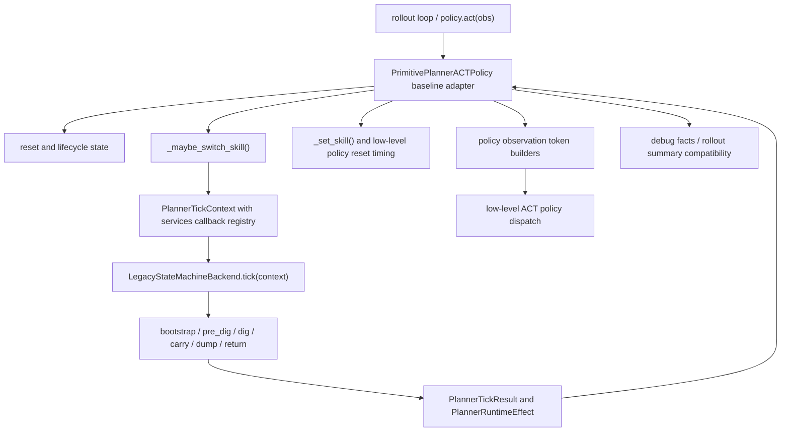

# Planner Baseline Architecture Map

Status: initial baseline map. Expand this from branch baseline code and rollout
logs before migrating the next live planner path.

Branch baseline: `f004d5ae2b38630456e3b1a58c602f655eb5de12`
(`f004d5a Move policy conditioning state into planner runtime`).

Do not record round-by-round changes here. This file owns the baseline
architecture and target data-flow map only. Append execution records to
`docs/planner_rollout_evidence_refactor_log.md`.

## Purpose

This file prevents future refactor rounds from using the current partially
refactored HEAD as the architecture source of truth. Each live migration should
start by reading the branch baseline planner code, matching it against real
rollout evidence, and updating this map before code motion.

Current HEAD may be useful as a patch queue or implementation history, but it is
not by itself the target design.

## Baseline Entry Flow

## Baseline Facts

These references are from the branch baseline file
`testbed/policies/hybrid/primitive_planner.py` at `f004d5a`.

- `class PrimitivePlannerACTPolicy`: line 305.
- `reset`: line 505.
- `_maybe_switch_skill`: line 1087.
- `_set_skill`: line 1253.
- `_policy_observation_token_request`: line 2709.
- `_return_target_tokens_for_obs`: line 2722.
- `_ensure_return_target_plan_for_cycle`: line 2770.
- `_dig_cut_tokens_for_obs`: line 2830.
- `_ensure_dig_cut_plan_for_cycle`: line 2881.
- `_dig_cut_plan_state_from_builder`: line 3081.
- `_dig_cut_plan_dispatch_facts`: line 3153.
- `_dig_cut_runtime_status_snapshot`: line 3276.
- `_debug_state_facts`: line 3564.

At this baseline, `_legacy_fsm_tick_context` builds a `PlannerTickContext` with
a string-keyed services callback registry. `LegacyStateMachineBackend` reads
those callbacks to run bootstrap, pre-dig, dig, carry, dump, and return
branches.

## Target Direction

The next architecture should make the default planner easy to understand before
making it pluggable:

- public policy adapter: owns policy API, low-level ACT dispatch, reset timing,
  debug and rollout compatibility
- runtime state: owns lifecycle state, blackboard state, conditioning state, and
  typed tick context
- backend: reads typed context, makes one decision tick, and returns explicit
  result/effects
- capability modules: own confirmed-live domain logic such as dig transition,
  carry/dump lifecycle, return handoff, token planning, and reporting
- deletion path: removes old inline logic after parity, unless a documented
  compatibility owner remains

## Evidence Overlay

Each migration round must add the selected rollout evidence here before moving
code:

- rollout artifact path or command:
- observed skill sequence:
- observed switch reasons:
- observed token source or debug keys:
- branch-baseline method chain:
- parity command:

## Classification

Use this section to classify branch-baseline code before migration:

- `confirmed-live`: observed in rollout evidence and eligible for extraction
- `not-observed`: present in baseline code but absent from selected evidence
- `test-only`: required by tests or diagnostics only
- `compatibility`: public entry that remains as a thin wrapper
- `dead-candidate`: no rollout evidence and no compatibility owner

Do not promote current HEAD helper shape into the target architecture unless it
survives this baseline and evidence check.
