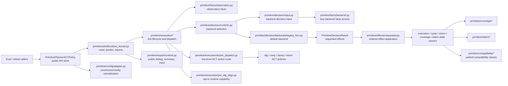

# Planner Current Architecture

Status: **active current planner architecture entry point**.

This document is the front door for the current primitive planner shape. It
describes the architecture that exists in the worktree now, not the older
intermediate SVG target or a future backend system.

Use this document with:

- `docs/planner_primitive_interface_standard.md`
- `docs/planner_decision_theory_backend_contract.md` for scoped
  decision-theory backend preparation
- `docs/planner_current_code_architecture_plan.md`
- `docs/planner_rollout_evidence_refactor_plan.md`
- `docs/planner_rollout_evidence_refactor_log.md`

Historical design drafts and migration simulations live under
`docs/refactor_history/planner/`. They are useful for risk context, but they are
not current implementation targets.

## Current Architecture Claim

The current implementation is:

- a public `PrimitivePlannerACTPolicy` shell;
- a focused primitive planner package under `testbed/planner/primitive/...`;
- a default legacy FSM backend wired through generic decision-runtime
  contracts;
- backend-ready at the contract level for future scheduling backends;
- not a complete BT, VLM, LLM, learned-backend, plugin, or production backend
  routing system.

The accurate maturity statement remains:

```text
default legacy FSM backendified with focused services
```

Do not describe the current planner as fully backend-swappable.

## Architecture Diagram



## Package Lanes

| Lane | Current responsibility | Representative files |
| --- | --- | --- |
| Public shell | External policy adapter and composition welds only | `testbed/policies/hybrid/primitive_planner.py`, `testbed/planner/primitive/shell/runtime_kernel.py` |
| Config | Constructor/config normalization and compatibility field updates | `testbed/planner/primitive/config/adapter.py` |
| Execution | Reset, tick lifecycle, boundary event, skill lifecycle, action dispatch, dig progress/recovery, opt-in pre-dig align runtime | `testbed/planner/primitive/execution/*.py` |
| Facts | Read-only observation, decision, and backend fact projection | `testbed/planner/primitive/facts/*.py` |
| Decision | Backend-neutral decision contracts, runtime selection, backend input, default legacy FSM backend | `testbed/planner/primitive/decision/*.py`, `testbed/planner/primitive/decision/backends/*.py` |
| Effects | Requested-effect validation/application and return handoff effects | `testbed/planner/primitive/effects/*.py` |
| Coverage | Coverage state, config, selection, update/effect, report, and candidate facts | `testbed/planner/primitive/coverage/*.py` |
| Token | Token state, observation injection, planning, conversion, and report status | `testbed/planner/primitive/token/*.py` |
| Report | Public debug, rollout summary, and planner trace composition | `testbed/planner/primitive/report/*.py` |
| Compatibility | Parked public compatibility state/report material | `testbed/planner/primitive/compatibility/*.py` |

## Public Shell Boundary

`PrimitivePlannerACTPolicy` may still:

- preserve public constructor compatibility;
- expose `reset`, `predict`, `debug_state`, `rollout_summary`, and
  `planner_trace`;
- hold low-level ACT policy handles and the boundary detector;
- construct focused state owners and runtime ports;
- register the default `legacy_fsm` decision backend factory;
- weld dynamic callbacks that cross the external policy boundary.

It must not regain:

- coverage scoring, selection, update, or report algorithms;
- token planning algorithms or token schema manipulation;
- backend fact projection or concrete branch logic;
- requested-effect mutation internals;
- report schema assembly;
- broad planner-self ports, blackboards, callback bags, or generic config bags.

Remaining shell methods should be judged by responsibility, not by line count.
Accepted shell welds are explicit dynamic boundary wiring. Glue that merely
protects old private names or forwards to old policy methods should be migrated
or classified.

## Runtime Flow

The current live flow is:

```text
PrimitivePlannerACTPolicy.predict(obs)
  -> PrimitivePlannerPublicRuntime / runtime kernel
  -> execution preparation and boundary-event projection
  -> PrimitiveDecisionRuntime.select_backend(...)
  -> PrimitiveBackendDecisionInputBuilder
  -> default LegacyFSMDecisionBackend
  -> PrimitiveDecisionResult with ordered requested effects
  -> PrimitiveRequestedEffectRuntime / RequestedEffectApplier
  -> action dispatch to the active low-level ACT policy or focused action path
  -> tick finalization and report-state projection
```

This is the architecture that future planner work should preserve unless a user
explicitly approves a semantic change.

## Restored And Parked Paths

- `pre_dig_align` is a user-approved, opt-in runtime capability. Its live
  runtime owner is
  `testbed/planner/primitive/execution/pre_dig_align.py`.
- `cell_entry` remains parked compatibility/report material in primitive
  planner runtime. Enabled primitive-planner `cell_entry` runtime config should
  still fail fast.
- 5P, BT, VLM, LLM, learned scheduling backends, plugin routing, and production
  backend config selection remain out of scope until a future phase explicitly
  starts them.
- `docs/planner_decision_theory_backend_contract.md` is a planning contract for
  one such future phase; it does not change the current runtime flow by itself.

## Documentation Ownership

Update this document when the actual package lanes, runtime flow, or backend
readiness claim changes. Append execution evidence to
`docs/planner_rollout_evidence_refactor_log.md`; do not turn this architecture
entry point into a round-by-round change log.
