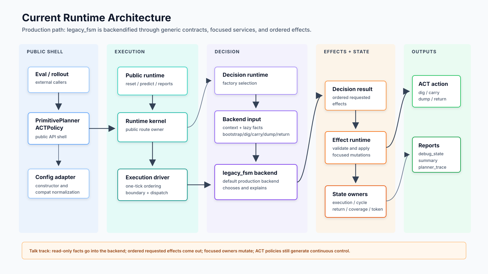
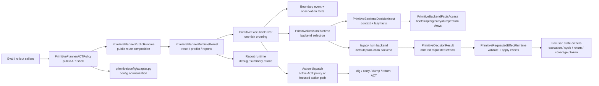
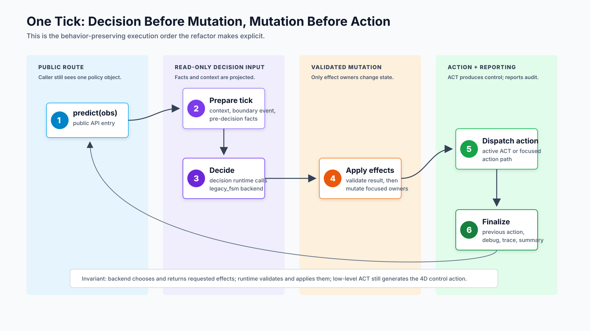
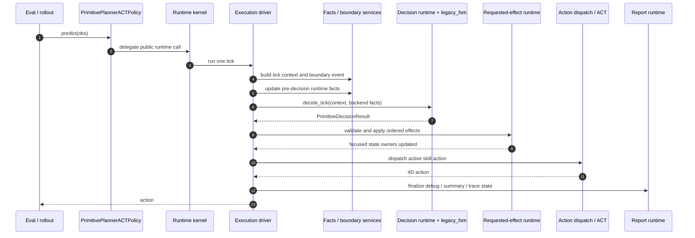
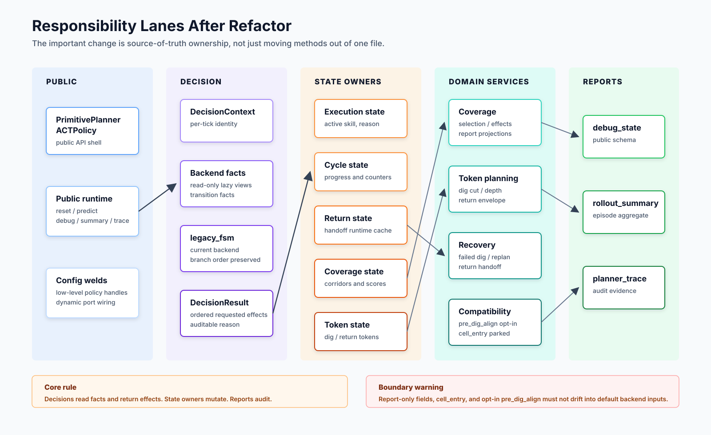
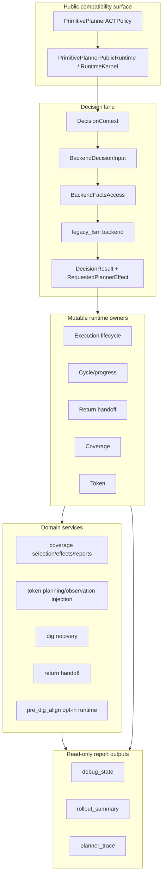
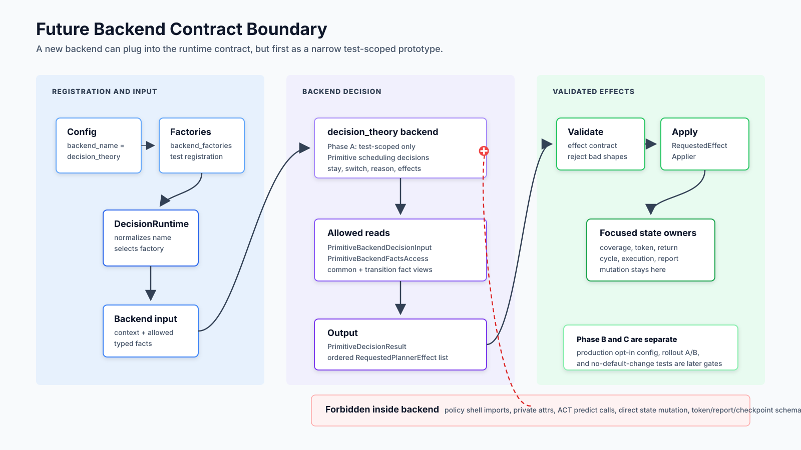
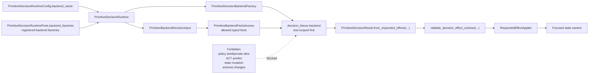
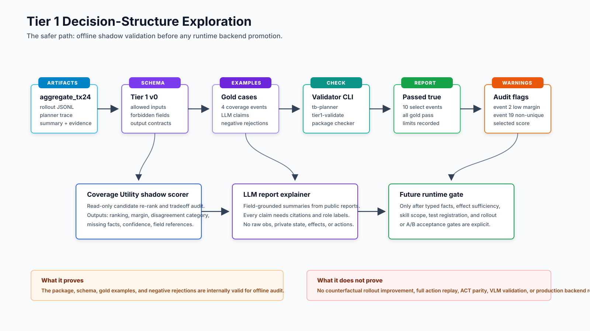
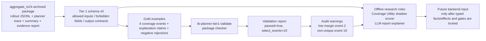

# Planner Refactor Branch Talk Outline

Status: presentation briefing derived from current docs.

Use this as a speaking aid for explaining the current refactor branch to
teammates. It is not a new source of truth for implementation semantics. The
source documents remain:

- `docs/planner_current_architecture.md`
- `docs/planner_current_code_architecture_plan.md`
- `docs/planner_primitive_interface_standard.md`
- `docs/planner_scheduling_backend_design.md`
- `docs/planner_decision_theory_backend_contract.md`
- `docs/planner_decision_structure_research_roadmap.md`
- `docs/planner_decision_structure_tier1_schema_v0.md`
- `docs/planner_decision_structure_tier1_gold_examples_v0.md`

## SVG Figures

- [Current runtime architecture](figures/planner_refactor_runtime_architecture.svg)
- [One tick execution flow](figures/planner_refactor_tick_flow.svg)
- [Responsibility lanes](figures/planner_refactor_responsibility_lanes.svg)
- [Future backend contract boundary](figures/planner_refactor_backend_contract.svg)
- [Tier 1 decision-structure exploration pipeline](figures/planner_decision_structure_tier1_pipeline.svg)

## Opening Claim

This branch turns the primitive planner from a large policy class into a public
adapter plus focused runtime lanes. The current production behavior is still the
legacy FSM path, but it is now routed through backend-neutral contracts,
read-only facts, ordered requested effects, and focused state owners. The new
decision-backend work is at contract/prototype-readiness level, not production
default replacement level.

## Diagram 1: Current Runtime Architecture

How to explain it:

- Start from the caller: external eval/rollout still sees one policy object.
- Then point out the key inversion: planner logic no longer lives mainly in the
  public shell; the shell wires focused owners and runtimes.
- The current backend is still `legacy_fsm`, but it now uses the same
  decision-result and requested-effect shape that future backends must use.
- The most important boundary is read-only facts in, requested effects out.

Avoid saying:

- "The backend is fully swappable now."
- "Behavior tree / LLM / VLM backend already exists."
- "This branch changes planner semantics."

Better wording:

- "The confirmed-live 4P legacy FSM path has been backendified with focused
  services."
- "The code is contract-ready for scoped backend experiments, not production
  backend-routing complete."

## Diagram 2: One Tick Of Execution

How to explain it:

- This is the refactor's practical value: one tick now has an auditable order.
- Decisions happen before effect application; effect application happens before
  action dispatch and reporting.
- A backend can choose and explain, but it does not directly mutate coverage,
  token, return, cycle, execution, or report state.
- The action is still generated by the low-level ACT policies; planner output is
  active skill, tokens, handoff/replan decisions, and effects.

## Diagram 3: Responsibility Lanes

How to explain it:

- The design rule is ownership clarity.
- Data/facts are read-only for decision; mutation is centralized through effect
  application and focused owners.
- Coverage and token logic are not backend code. They are services and state
  owners consumed by the runtime.
- Report outputs are for audit and debugging; they are not silently promoted
  into decision-source facts.

Special path wording:

- `pre_dig_align`: restored as explicit opt-in runtime capability, not default
  mainline semantics.
- `cell_entry`: parked compatibility/report material, not a primitive-planner
  runtime input.
- 5P / BT / VLM / LLM / learned backend / plugin routing: out of current
  production scope.

## Diagram 4: Future Backend Contract Boundary

How to explain it:

- The first backend name in the contract is `decision_theory`.
- Phase A should be test-only registration through `backend_factories`.
- Production shell registration and YAML/config selection are separate future
  decisions.
- A new backend should make primitive scheduling decisions only: stay/switch,
  reason, and requested effects.
- It should not generate low-level actions, build tokens, score coverage, or
  mutate runtime state.

Acceptance framing:

- If the first backend is parity-preserving, say what parity means.
- If it is shadow-only, say it cannot affect live rollout.
- If it changes semantics, choose explicit A/B or rollout acceptance gates
  before production registration.

## Diagram 5: Decision-Structure Exploration Pipeline

How to explain it:

- This is intentionally safer than implementing a new online backend first.
- The current research goal is explanation, shadow evaluation, replay
  validation, and risk reduction.
- Coverage Utility can re-rank or explain candidate tradeoffs, but it cannot
  claim rollout improvement without counterfactual labels.
- The LLM explainer can summarize public reports with field citations, but it
  cannot become a decision source.
- The checker passing means the package and gold examples are internally
  consistent. It does not prove full offline action replay, ACT parity, or
  production backend readiness.

## Suggested 20-30 Minute Flow

### 1. Context, 2-3 minutes

Say:

> This branch is about turning a large primitive planner class into a clearer
> control architecture. The important thing is not line-count reduction by
> itself; it is separating public API, one-tick execution order, decision
> backend contracts, effect application, state ownership, and reporting.

Then show Diagram 1.

### 2. What Changed In The Code Architecture, 8-10 minutes

Use Diagrams 1-3.

Core points:

- The public API is stable: `reset`, `predict`, `debug_state`,
  `rollout_summary`, `planner_trace`.
- `PrimitivePlannerACTPolicy` is now closer to a public adapter and composition
  weld.
- The runtime kernel and execution driver make per-tick ordering explicit.
- The default production backend is still `legacy_fsm`.
- Decision code reads typed facts and returns ordered effects; focused runtimes
  apply those effects.
- Coverage/token/return/report logic moved into responsibility lanes rather than
  living as planner-private helper clusters.

Good sentence:

> The key invariant is: decisions choose and explain; effect owners mutate;
> ACT policies generate continuous control.

### 3. What Is Backend-Ready And What Is Not, 5-7 minutes

Show Diagram 4.

Core points:

- Generic backend factory selection exists.
- Fake-backend tests prove runtime contract selection and unsupported-backend
  fail-fast behavior.
- Production shell currently registers only `legacy_fsm`.
- `decision_theory` should start as test-scoped, not default production.
- Missing pieces before production: explicit facts, effect sufficiency, selected
  skill scope, rollout/A-B target, config route, and no-default-change tests.

Good sentence:

> We now have a door for alternate decision backends, but we have not decided
> that any alternate backend should walk through it in production.

### 4. New Decision-Structure Exploration, 7-10 minutes

Show Diagram 5.

Core points:

- The exploration starts offline/shadow because that is the safest place to
  compare decision structures.
- Tier 1 has two roles: Coverage Utility shadow scorer and LLM report explainer.
- The package validates 10 select-corridor events and records two important
  audit warnings: one low-margin case and one non-unique terminal selection.
- Gold examples are designed to prevent overclaiming: no counterfactual rollout
  improvement, no full action replay parity, no raw/private-field explanations,
  no `cell_entry` or `pre_dig_align` drift into default semantics.

Good sentence:

> The exploration is not "let an LLM drive the planner"; it is "use models and
> utility scoring under a citation/schema/audit contract before they are allowed
> near runtime decisions."

### 5. Close With Next Steps, 2-3 minutes

Recommended next steps:

- Keep `legacy_fsm` as production default.
- Implement `decision_theory` only as a narrow test-scoped backend if the first
  handled skill, facts, effects, and parity/shadow semantics are explicitly
  named.
- Extend the Tier 1 checker to validate external Coverage Utility shadow outputs
  and LLM explanation outputs.
- Promote anything toward runtime only after typed fact/effect boundaries and
  acceptance gates are locked.

Close with:

> The branch leaves us with a cleaner control architecture and a safer research
> path: production behavior stays protected, while new decision structures can
> be evaluated through explicit contracts, traceable facts, and auditable
> outputs.

## Likely Questions

Q: Is the planner fully backend-swappable now?

A: No. It is backend-ready at the generic runtime-contract level. Production
still registers only `legacy_fsm`, and the current facts packet is not yet a
complete backend-neutral packet for BT/VLM/learned strategies.

Q: Did this change rollout behavior?

A: The refactor intent is behavior-preserving for the confirmed-live 4P legacy
FSM path. Semantic changes, threshold changes, branch order changes, token
schema changes, and default config changes are out of scope unless explicitly
approved and tested.

Q: Why not implement the new decision backend directly?

A: Because the risky part is not writing a backend class. The risky part is
choosing the facts it may read, the effects it may request, the skill scope it
handles, and the evidence gate for accepting any semantic difference.

Q: What did the Tier 1 checker prove?

A: It proved the archived package, schema expectations, gold examples, and
negative rejection cases are internally valid for offline/shadow audit. It did
not prove full action replay, counterfactual rollout improvement, or production
backend readiness.

Q: Where do `pre_dig_align` and `cell_entry` stand?

A: `pre_dig_align` is an explicit opt-in runtime capability. `cell_entry` is
parked compatibility/report material. Neither should silently become default
mainline decision-backend input.
