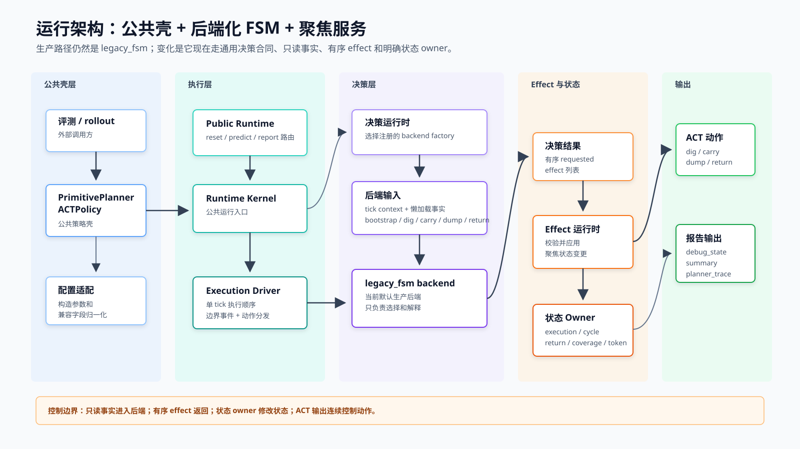
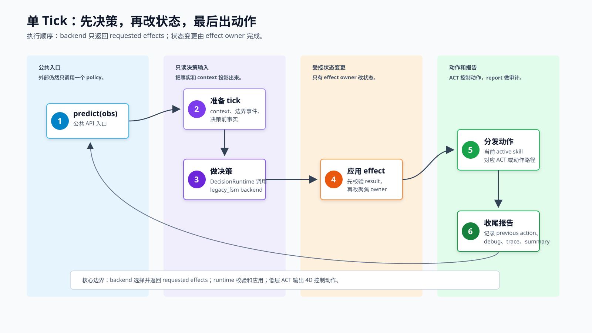
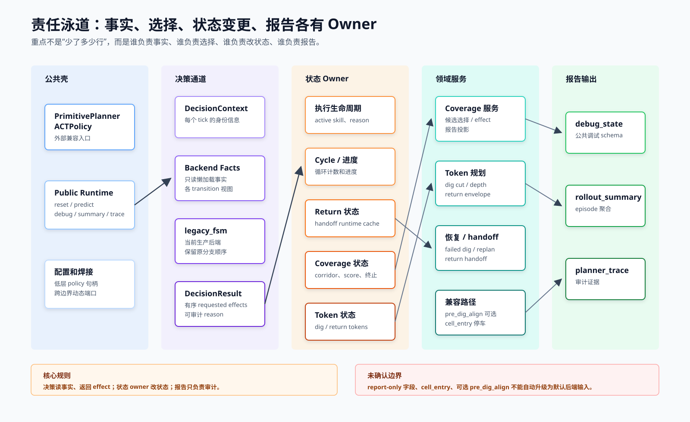
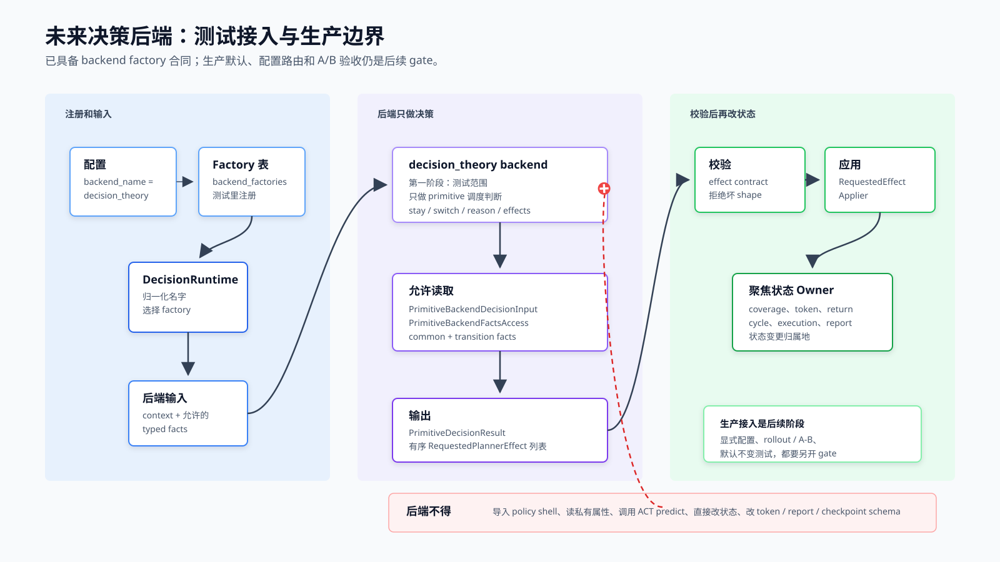
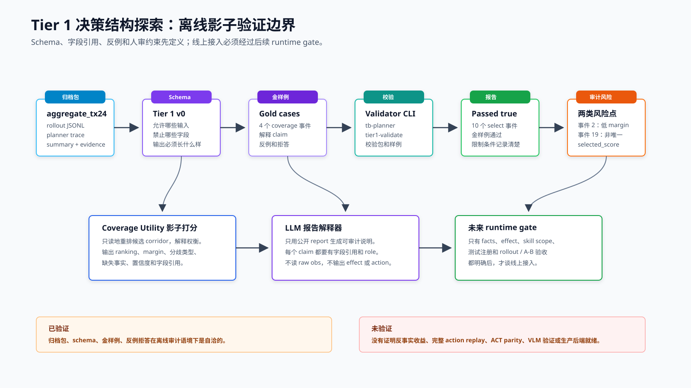

# Planner 重构 Branch：核心架构与决策后端边界

Status: presentation briefing derived from current docs.

实现语义以以下文档为准：

- `docs/planner_current_architecture.md`
- `docs/planner_current_code_architecture_plan.md`
- `docs/planner_primitive_interface_standard.md`
- `docs/planner_scheduling_backend_design.md`
- `docs/planner_decision_theory_backend_contract.md`
- `docs/planner_decision_structure_research_roadmap.md`
- `docs/planner_decision_structure_tier1_schema_v0.md`
- `docs/planner_decision_structure_tier1_gold_examples_v0.md`

## 核心结论

当前 branch 的核心变化不是把大文件拆小，而是把 primitive planner 的控制责任拆成清楚的边界：
公共 policy 壳、单 tick 执行顺序、只读事实、决策 backend、有序 requested effects、状态 owner、
领域服务和报告输出。

生产默认路径仍然是 `legacy_fsm`。它已经被放进 generic decision runtime 和 requested-effect
合同里，因此具备了受控接入新决策后端的基础，但这不等于已经形成完整的生产级 backend
routing 系统。

新决策结构探索应先停留在离线、影子、可审计阶段。Coverage Utility shadow scorer 和 LLM report
explainer 可以帮助解释、比较和暴露缺失事实，但不能直接替换线上调度，也不能证明反事实 rollout
收益。

## 图表入口

- [当前运行架构](figure/zh/planner_refactor_runtime_architecture_zh.svg)
- [单 tick 执行流](figure/zh/planner_refactor_tick_flow_zh.svg)
- [责任泳道](figure/zh/planner_refactor_responsibility_lanes_zh.svg)
- [未来后端接入合同边界](figure/zh/planner_refactor_backend_contract_zh.svg)
- [Tier 1 决策结构探索流水线](figure/zh/planner_decision_structure_tier1_pipeline_zh.svg)

## 1. 当前运行架构

读者需要理解的结构：

- 外部 eval / rollout 仍然只调用 `PrimitivePlannerACTPolicy`。
- `PrimitivePlannerACTPolicy` 的主要职责是公共 API 兼容、配置归一化和跨边界 wiring。
- 单 tick 执行进入 `PrimitivePlannerRuntimeKernel` 和 `PrimitiveExecutionDriver`。
- `PrimitiveDecisionRuntime` 根据注册表选择 backend；当前生产默认 backend 是 `legacy_fsm`。
- backend 读取只读 facts，返回 `PrimitiveDecisionResult` 和有序 requested effects。
- `PrimitiveRequestedEffectRuntime` 校验并应用 effects；状态修改归属于 execution、cycle、return、
  coverage、token 等 focused state owners。
- ACT 仍然负责输出连续 4D 控制动作；report runtime 负责 `debug_state`、`rollout_summary` 和
  `planner_trace`。

概念边界：

- 已成立：确认 live 的 4P legacy FSM 路径已经 backendified，大部分领域工作已经进入 focused services。
- 未成立：当前 planner 还不是完全 backend-swappable；BT / LLM / VLM backend 尚未接入生产。

## 2. 单 Tick 执行流

一个 planner tick 的顺序是：

1. `predict(obs)` 进入公共 policy。
2. runtime 准备 context、边界事件和决策前 facts。
3. decision runtime 调用当前 backend。
4. backend 返回决策结果和 requested effects。
5. runtime 校验 effect contract，并由 effect owner 修改聚焦状态。
6. action dispatch 调用当前 active skill 对应的 ACT 或 focused action path。
7. runtime 记录 previous action，并更新 debug、summary 和 trace。

关键概念：

- backend 只负责选择和解释。
- effect owner 负责状态变更。
- ACT policy 负责连续控制。
- report 输出用于审计，不应反向成为未确认的决策事实来源。

## 3. 责任泳道

各层责任：

- 公共壳：保留外部接口和兼容入口，不承载新的 planner 领域算法。
- 决策通道：从 context 和 typed facts 得到 decision result，不直接改状态。
- 状态 owner：保存 live mutable state，是 mutation 的归属地。
- 领域服务：coverage selection、token planning、return handoff、dig recovery 等可复用能力。
- 报告输出：提供 debug、summary、trace，用于审计和诊断。

兼容路径的边界：

- `pre_dig_align` 是显式 opt-in runtime capability，不是默认主线语义。
- `cell_entry` 是 parked compatibility / report material，不是 primitive planner runtime 输入。
- 5P、BT、VLM、LLM、learned backend、plugin routing 都不属于当前生产默认范围。

## 4. 未来决策后端合同边界

未来 backend 的安全接入方式：

- 通过 `PrimitiveDecisionRuntimePorts.backend_factories` 注册 backend factory。
- 通过 `PrimitiveDecisionRuntimeConfig.backend_name` 选择 backend。
- backend 消费 `PrimitiveBackendDecisionInput` 和允许的 typed facts。
- backend 输出 `PrimitiveDecisionResult` 和有序 `RequestedPlannerEffect`。
- effect contract 校验通过后，`RequestedEffectApplier` 才能修改 focused state owners。

第一版 `decision_theory` backend 的合理范围：

- 先做 test-scoped prototype。
- 先处理明确声明的 primitive scheduling 决策：stay、switch、reason、requested effects。
- 不生成低层动作，不构造 token，不做 coverage scoring，不直接读写 runtime state。
- production shell 注册、YAML/config 选择、默认 backend 切换、rollout / A-B 验收，都应作为后续独立 gate。

验收前必须明确：

- 第一版 backend 是 parity-preserving、shadow-only，还是 semantics-changing。
- 首批处理哪些 active skills。
- 需要哪些 typed facts。
- 复用哪些 existing requested effects。
- 是否需要新增 effect，以及新增 effect 的 owner、校验和测试。
- 生产默认仍为 `legacy_fsm` 的 no-default-change 测试是否覆盖。

## 5. Tier 1 决策结构探索

Tier 1 的定位：

- 先做离线和 shadow validation，再讨论 runtime 接入。
- 输入来自归档的 rollout JSONL、planner trace、summary 和 evidence report。
- schema 明确允许输入、禁止字段、输出结构和字段引用规则。
- gold examples 固定容易过度解释的样例。
- checker 当前验证 10 个 select-corridor events，并记录低 margin 和 selected-score 非唯一等审计风险。

两个离线角色：

- Coverage Utility shadow scorer：只读地重排 coverage candidates，输出 ranking、margin、分歧类型、缺失事实、
  置信度和字段引用。它不能声称会改善 rollout outcome，因为没有 counterfactual outcome labels。
- LLM report explainer：只从公开 report 生成字段引用式解释。它不能读取 raw obs、private state，也不能输出
  live action 或 requested effects。

Tier 1 checker 证明的是：

- 归档包、schema、gold examples 和 negative rejections 在离线审计语境下自洽。

Tier 1 checker 没有证明：

- 反事实 rollout 收益。
- 完整 offline action replay。
- ACT parity。
- VLM/raw-observation validation。
- 生产 backend readiness。

## 理解路径

1. 当前 branch 是控制架构重构，不是单纯拆文件。
2. 公共壳保留，生产默认仍是 `legacy_fsm`，内部决策链路已经合同化。
3. 单 tick 内的决策、effect mutation、ACT action 和 report update 顺序已经显式化。
4. 事实、选择、状态变更、领域服务和报告各自有 owner。
5. 新 backend 可以被测试性接入，但生产接入必须另过 facts、effects、scope 和验收 gate。
6. 新决策结构先在离线/影子/人审框架下验证，再考虑 runtime 化。

## 关键问答边界

**当前 planner 是否已经完全 backend-swappable？**

还没有。当前是 generic runtime contract 层面 ready；生产 shell 仍然只注册 `legacy_fsm`。

**这次重构是否改变 planner 行为？**

重构目标是行为保持。branch order、reason string、token schema、reset timing、默认 config 和阈值都不应隐式改变。

**为什么不能直接写新的 decision backend？**

backend class 本身不是主要风险。主要风险是它允许读取哪些 facts、允许请求哪些 effects、覆盖哪些 skill、
以及如何验收任何语义差异。

**Tier 1 checker 的作用是什么？**

它验证离线包、schema、gold examples 和反例拒答是否自洽；它不验证生产调度效果。

**`pre_dig_align` 和 `cell_entry` 应如何定位？**

`pre_dig_align` 是 opt-in runtime capability；`cell_entry` 是 parked compatibility / report material。
两者都不应自动升级为默认决策后端输入。
