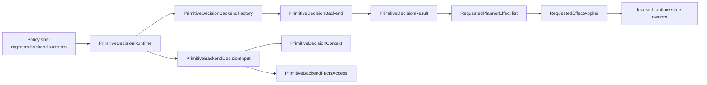

# Planner Scheduling Backend Design Guide

Status: **active design guide for future scheduling/decision backends**.

This document explains how a future scheduling backend should attach to the
current primitive planner contracts. It is a design guide and integration
checklist. It does not claim that BT, VLM, LLM, learned, plugin-routed, or
production-config-selected backends already exist.

Use this guide with:

- `docs/planner_current_architecture.md`
- `docs/planner_primitive_interface_standard.md`
- `tests/test_primitive_backend_ready_contract.py`

Historical backend drafts under `docs/refactor_history/planner/` are useful for
context only. If they conflict with this guide or the current code, this guide
and the current code win.

## Current Readiness

The current planner is backend-ready at the generic runtime-contract level:

- `PrimitiveDecisionRuntime` normalizes and selects a registered backend
  factory;
- `PrimitiveDecisionRuntimePorts.backend_factories` is the current registration
  surface;
- the production shell currently registers only `legacy_fsm`;
- unsupported backend names fail fast;
- focused fake-backend tests prove the generic runtime/factory contract;
- production plugin discovery and user-facing backend config routing are not
  implemented.

The current backend path is still the default legacy FSM adapter. Future
backends should reuse the generic decision, fact, input, and effect contracts
instead of reading `PrimitivePlannerACTPolicy` or policy private methods.

## Backend Contract Diagram



Backends choose and explain. Effect runtimes mutate focused planner state.

## Allowed Production Import Surface

Future backend code may depend on the production contracts below.

Decision/runtime contracts:

- `testbed.planner.primitive.decision.context.PrimitiveDecisionContext`
- `testbed.planner.primitive.decision.contracts.PrimitiveDecisionResult`
- `testbed.planner.primitive.decision.contracts.RequestedPlannerEffect`
- concrete requested-effect records from
  `testbed.planner.primitive.decision.contracts`
- `testbed.planner.primitive.decision.runtime.PrimitiveDecisionRuntime`
- `testbed.planner.primitive.decision.runtime.PrimitiveDecisionRuntimeConfig`
- `testbed.planner.primitive.decision.runtime.PrimitiveDecisionRuntimePorts`
- `testbed.planner.primitive.decision.backends.legacy_fsm.PrimitiveDecisionBackend`
- `testbed.planner.primitive.decision.backends.legacy_fsm.PrimitiveCompatibilityDecisionBackend`
- `testbed.planner.primitive.decision.backends.legacy_fsm.PrimitiveDecisionBackendFactory`

Facts/input contracts:

- `testbed.planner.primitive.facts.decision.PrimitiveDecisionFacts`
- `testbed.planner.primitive.facts.backend.PrimitiveBackendFactsPorts`
- `testbed.planner.primitive.facts.backend.PrimitiveBackendFactsSource`
- `testbed.planner.primitive.facts.backend.PrimitiveBackendFactsAccess`
- typed transition fact views from
  `testbed.planner.primitive.facts.decision`
- `testbed.planner.primitive.decision.input.PrimitiveBackendDecisionInput`
- `testbed.planner.primitive.decision.input.PrimitiveBackendDecisionInputBuilder`

Effect application contracts:

- `testbed.planner.primitive.effects.requested.RequestedEffectApplier`
- `testbed.planner.primitive.effects.requested.RequestedEffectApplierPorts`
- `testbed.planner.primitive.effects.requested.PrimitiveRequestedEffectRuntime`
- `testbed.planner.primitive.effects.requested.PrimitiveRequestedEffectRuntimePorts`

Design documents are not production import contracts.

## Future Backend Implementation Shape

A new backend should normally live under:

```text
testbed/planner/primitive/decision/backends/<stable_backend_name>.py
```

Expected shape:

1. Implement a backend factory compatible with
   `PrimitiveDecisionBackendFactory`.
2. Build a backend object compatible with `PrimitiveDecisionBackend`, or with
   `PrimitiveCompatibilityDecisionBackend` only when compatibility routing is
   explicitly required.
3. Consume `PrimitiveBackendDecisionInput` and read facts through
   `PrimitiveBackendFactsAccess` or typed decision fact views.
4. Return `PrimitiveDecisionResult` with ordered requested effects.
5. Leave state mutation to `PrimitiveRequestedEffectRuntime` and focused effect
   services.
6. Register the factory through `PrimitiveDecisionRuntimePorts.backend_factories`
   in a scoped production weld or test harness.

Adding a user-facing backend selector, plugin registry, config schema, or
runtime route is a separate product decision. Do not smuggle it into the first
backend implementation unless explicitly requested.

## Backend Rules

Future backends must not:

- import `testbed.policies.hybrid.primitive_planner`;
- depend on `PrimitivePlannerACTPolicy`, policy private methods, private
  attributes, broad planner-self objects, callback bags, blackboards, or design
  documents;
- mutate coverage, token, return, cycle, execution, or report state directly;
- reorder existing legacy-FSM branches or reason strings while claiming to be a
  behavior-preserving backend;
- introduce hidden token schema, report schema, reset timing, threshold, or
  checkpoint compatibility changes;
- treat `cell_entry`, 5P, BT, VLM, LLM, or learned backend support as implied by
  this guide.

Future backends should:

- prefer typed fact views over ad hoc observation parsing;
- request effects rather than applying effects;
- add focused tests before production registration;
- update `docs/planner_current_architecture.md`,
  `docs/planner_primitive_interface_standard.md`, and the rollout evidence log
  when the production backend surface changes.

## Readiness Checklist

Before a new backend is accepted:

- backend module owns a stable responsibility and name;
- backend imports only allowed production contracts;
- no primitive lane module imports the policy shell;
- focused tests prove factory selection, decision input consumption, and
  requested-effect output;
- behavior-preserving work includes parity or rollout-evidence gates for branch
  order, reason strings, public reports, token schemas, reset timing, and
  default legacy FSM behavior;
- docs distinguish contract readiness from actual production routing.
