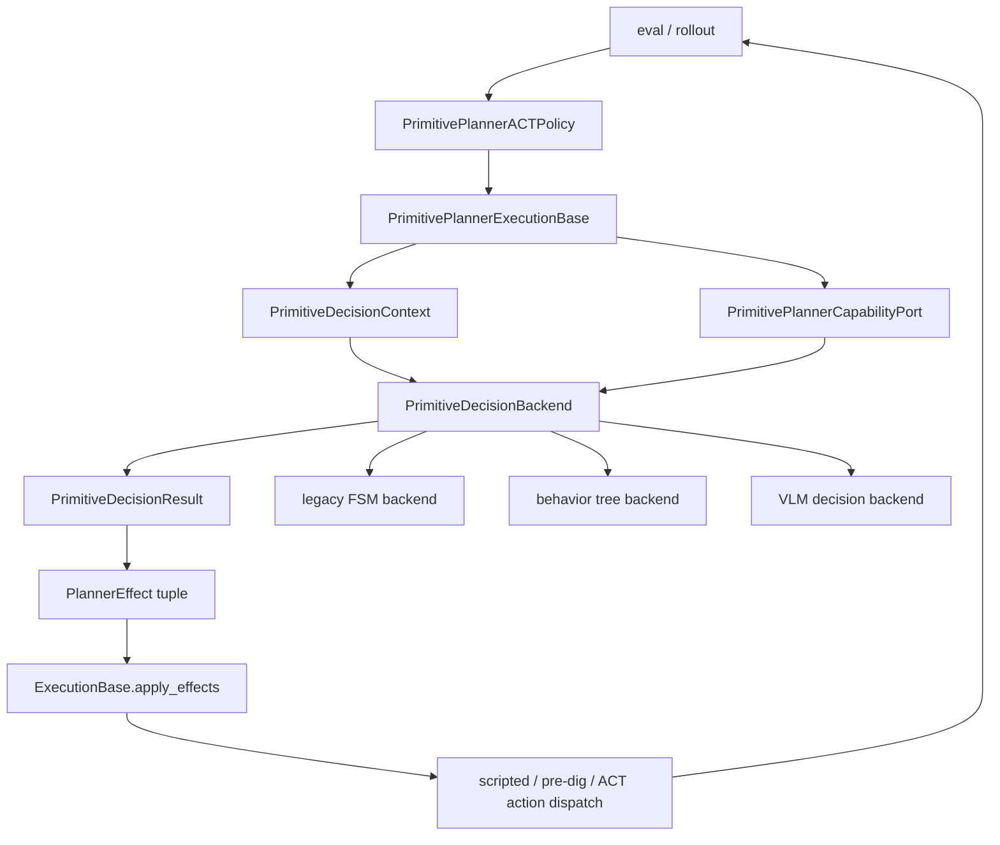

# Planner Execution Backend Abstraction Analysis

Status: **historical supporting analysis only**.

The current implementation source of truth is
`docs/planner_current_architecture.md` and
`docs/planner_current_code_architecture_plan.md`. This analysis explains why
the execution-kernel/backend direction exists, but it must not be used as the
file-ownership map, migration checklist, or current module inventory. If this
document conflicts with the current-code architecture plan, the current-code
plan wins.

Baseline used for code understanding:
`152350e3ed9a8816ca8d685195fc8f297ab3fcec`.

Current working-tree rule for this round:

- planner/runtime/eval/data/policy code has been restored to the branch-created
  baseline
- current docs, workflow guard, and hook files are preserved
- no planner behavior has been migrated

## Problem Statement

At the branch-created baseline, `PrimitivePlannerACTPolicy` is both:

- the public `Policy` adapter used by eval and rollout
- the execution owner for low-level ACT dispatch, reset timing, debug output,
  rollout summary, token injection, coverage state, return-target state, and
  skill lifecycle state
- the decision owner for the inline 4P state machine in `_maybe_switch_skill()`

This makes the useful facts and token logic hard to reuse. A behavior tree, a
legacy finite-state machine, a VLM-backed decision policy, or any future atomic
action scheduler should be able to reuse the same metrics, gates, tokens,
coverage state, and effect application semantics without duplicating the large
file.

The goal is therefore not to make every decision scheme inherit the large class.
The goal is to turn the large class into a stable execution kernel and expose a
small decision-backend interface.

## Core Direction

Use two boundaries:

1. `PrimitivePlannerExecutionBase`: the abstract execution kernel.
2. `PrimitiveDecisionBackend`: the pluggable decision backend protocol.

The execution kernel owns reusable planner capabilities and side effects. The
decision backend owns only the choice of what should happen next.

Because the branch-created baseline couples the giant planner directly to the
inline state machine, the first abstraction should be the execution loop, not
the decision backend. In other words, separate "how one planner tick is
executed" from "which state-machine branch or decision node is chosen."



External layers should still see only:

- `reset()`
- `predict(obs) -> action`
- `debug_state()`
- `rollout_summary()`
- `planner_trace()`

They should not know whether the decision backend is an inline state machine,
behavior tree, VLM, or any other scheduler.

## What The Abstract Execution Base Owns

The execution base should own behavior that every backend must share:

- public `Policy` lifecycle and compatibility surface
- low-level ACT policy dispatch and reset timing
- observation fact extraction from `obs`
- semantic boundary event update through `BoundaryDetector`
- active skill state, switch reason, cycle counters, hold counters, return
  counters, and timeout counters
- pre-dig, dig, carry, dump, return, coverage, and token runtime state
- metric helpers such as mass, deposit, target geometry, local surface depth,
  envelope error, and coverage remaining depth
- token planning and injection for goal, cell-entry, dig-cut, depth-profile,
  return-target, return-relocate, and return-start-envelope tokens
- coverage corridor selection, completion, rejection, depletion, and terminal
  stop state
- debug, trace, and rollout summary schema assembly
- validation and application of backend-returned effects

The base class may provide abstract methods only for backend selection or
backend construction. It should not make state-machine branch decisions itself
once the backend boundary exists.

## Execution Logic First

At the baseline, `predict()` already has an execution skeleton wrapped around
the inline state machine:

1. update boundary event from previous action and current observation
2. clear switch reason
3. update dig progress when current skill is `dig`
4. run `_maybe_switch_skill()`
5. update return step and timeout counters
6. dispatch scripted bootstrap, pre-dig alignment, or active ACT policy
7. copy previous action
8. compute transition-completed flag
9. rebuild debug state
10. return action

This skeleton is execution logic. It is not the decision scheme. It should be
the first thing isolated behind methods such as:

- `prepare_tick(obs) -> PrimitiveTickPreparation`
- `decide_tick(preparation) -> PrimitiveDecisionResult`
- `apply_decision(result)`
- `dispatch_action(obs) -> np.ndarray`
- `finalize_tick(action, result) -> np.ndarray`

Initially, `decide_tick()` can still call the old inline `_maybe_switch_skill()`
or a local legacy decision adapter. The important first split is that the
public `predict()` flow becomes a stable execution template. Once that template
exists, a state machine, behavior tree, VLM, or learned scheduler can occupy the
same decision slot without changing action dispatch, token injection, debug
schema, or policy reset timing.

This avoids extracting a backend while the execution loop is still implicit in
the giant planner.

## What Backends Own

A backend owns decision policy only:

- which branch or node is evaluated
- which facts or gates are read from the capability port
- which ordered effects are requested
- backend-local diagnostics

Backends must not:

- mutate the planner object directly
- reset low-level policies directly
- assemble low-level ACT observations directly
- write debug or rollout summary fields directly
- duplicate token dimensions, token order, env-state indices, or schema facts
- decide hidden side effects by mutating `PrimitivePlannerACTPolicy`

## Capability Port

The backend should not receive raw `self`. It should receive a narrow capability
port. The port is the controlled way to reuse the giant baseline logic.

Example surface:

```python
class PrimitivePlannerCapabilityPort(Protocol):
    def bootstrap_ready(self, obs, boundary_event) -> bool: ...
    def pre_dig_alignment_status(self, obs) -> PreDigAlignStatus: ...
    def dig_transition_status(self, obs, boundary_event) -> DigTransitionStatus: ...
    def carry_transition_status(self, obs, boundary_event) -> CarryTransitionStatus: ...
    def dump_transition_status(self, obs, boundary_event) -> DumpTransitionStatus: ...
    def return_transition_status(self, obs, boundary_event) -> ReturnTransitionStatus: ...
    def coverage_status(self, obs) -> CoverageStatus: ...
    def token_status(self, obs) -> TokenStatus: ...
```

Each method should return typed facts, not perform irreversible side effects.
Side effects should be represented as `PlannerEffect` values and applied by the
execution base.

This is the key distinction from a pass-through facade: the port groups stable
domain facts that multiple decision backends need, instead of exposing old
private method names one by one.

## Backend Interface

A minimal backend interface should be effect-oriented:

```python
class PrimitiveDecisionBackend(Protocol):
    name: str

    def reset(self) -> None:
        ...

    def tick(
        self,
        context: PrimitiveDecisionContext,
        capabilities: PrimitivePlannerCapabilityPort,
    ) -> PrimitiveDecisionResult:
        ...
```

`PrimitiveDecisionContext` should contain:

- `obs`
- `boundary_event`
- active skill
- cycle and transition counters
- relevant read-only runtime state snapshots
- selected config values needed for decision branching

`PrimitiveDecisionResult` should contain:

- backend name and node path
- status
- reason string
- ordered `PlannerEffect` tuple
- diagnostics

`PlannerEffect` should be the only way a backend requests mutation. Candidate
effects include:

- `SetSkill(skill, reason)`
- `IncrementCounter(name)`
- `ResetHoldCounter(name)`
- `ClearDigCutPlan`
- `EnsureDigCutPlan`
- `EnsureReturnTargetPlan`
- `CompleteCellEntryDig`
- `CompleteCoverageDig`
- `CompleteCoverageDump(reason)`
- `RejectCoverageCorridor(reason)`
- `RestartPreDigAlign(reason)`
- `RestartDigWithNewCut(reason)`
- `RequestCoverageTerminalStop(reason)`
- `RecordBackendDiagnostic(payload)`

The execution base validates and applies these effects in one place.

## How Each Decision Scheme Fits

### Legacy State Machine

The first backend should reproduce the baseline `_maybe_switch_skill()` branch
order. It is the parity backend. It calls capability-port methods and returns
effects in the same order the baseline inline code mutates state.

This backend is eligible only after a rollout or golden trace locks the branch
order, reason strings, counters, reset timing, token flags, and debug fields.

### Behavior Tree

A behavior-tree backend should compile nodes into the same
`PrimitiveDecisionBackend.tick()` result. Nodes may read facts from the same
capability port. The tree implementation remains hidden from eval and rollout.

Behavior-tree nodes should not own token building, coverage mutation, or
low-level policy reset.

### VLM Decision Backend

A VLM backend should receive a constrained `DecisionObservationPacket`, derived
from the same capability port:

- active skill and cycle state
- compact metric facts
- gate statuses
- token-source statuses
- coverage and return-target summaries
- allowed next effects

The VLM output must be a validated structured decision, not arbitrary code or
direct planner mutation. The adapter should reject unsupported effects or
reason strings unless explicitly allowed.

### Future Learned Or Rule Backends

Any learned scheduler, option policy, or rule table should implement the same
backend protocol. If a new backend needs a fact that is not available, the fact
should be added to the capability port as a stable domain fact, not read from a
private planner field.

## Recommended Migration Shape

### Phase 0: Current Round

Completed in this working tree:

- restore planner/runtime/eval/data/policy code to the branch-created baseline
- keep current docs and workflow guard files
- document the baseline architecture and target abstraction

No runtime behavior migration is included in this phase.

### Phase 1: Lock The Baseline

Before touching planner code again:

- choose one rollout evidence packet or a golden trace artifact
- lock public debug, rollout summary, token flags, switch reasons, and action
  source selection for the selected path
- classify the selected path as `confirmed-live`, `compatibility`,
  `test-only`, or `not-observed`

### Phase 2: Extract The Execution Template

Before introducing alternate decision schemes, make the public tick flow
explicit:

- keep `PrimitivePlannerACTPolicy.predict()` as the public entry point
- move the execution steps into narrowly named methods
- keep the old inline `_maybe_switch_skill()` behavior as the only decision
  implementation
- verify no change in action source, switch reason, timeout flag, debug fields,
  or token injection flags

This phase should not create a behavior-tree or VLM backend. It only separates
the execution skeleton from the coupled state-machine decision body.

### Phase 3: Introduce Contracts Without Moving Branch Logic

Create small contracts outside `primitive_planner.py`:

- `PrimitiveDecisionContext`
- `PrimitiveDecisionResult`
- `PlannerEffect`
- `PrimitiveDecisionBackend`
- typed status records for capability-port methods

At this phase, the old inline `_maybe_switch_skill()` still owns behavior.

### Phase 4: Extract Capability Port

Move reusable facts behind stable domain methods:

- observation metrics
- pre-dig alignment status
- dig transition status
- carry/dump transition status
- return handoff/envelope status
- coverage status
- token status

Each extraction should remove direct duplicate fact construction from future
backend code. Avoid creating wrappers that simply mirror old private method
names.

### Phase 5: Move Legacy FSM Into A Backend

Only after capability facts and effects are locked:

- implement `LegacyStateMachineDecisionBackend`
- copy the baseline branch order from `_maybe_switch_skill()` into the backend
- return effects rather than mutating state
- keep `PrimitivePlannerACTPolicy` as the public adapter and effect applier
- verify parity before deleting the inline branch body

### Phase 6: Add Alternate Backends

Behavior tree, VLM, or future schedulers should be added only after the legacy
backend is the default parity path. They should use the same contracts and
capability port.

## Non-Goals

- Do not make behavior tree the default in the abstraction phase.
- Do not make VLM output mutate planner state directly.
- Do not preserve abandoned 5P behavior unless evidence or compatibility owner
  requires it.
- Do not expose backend choice or backend internals to eval/rollout beyond a
  stable config key and debug field.
- Do not split the large file by copying old private methods into many thin
  pass-through modules.

## Design Risk

The main risk is confusing "abstract class" with "shared mutable superclass for
every backend." That would recreate the same coupling through inheritance.

The safer interpretation is:

- abstract execution base owns shared execution and capability semantics
- decision backends are composed behind a protocol
- backends return explicit effects
- only the execution base mutates planner state and dispatches low-level policy

This keeps behavior tree, state machine, VLM, and later decision schemes hidden
behind the same execution interface while still letting them reuse the baseline
metrics, token, coverage, and gate logic.
