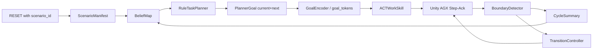

# V2.1 混合式多轮丝滑挖掘技术草案与代码开发计划

## 0. 这版方案的核心结论

V2.1 不再把“回到某个固定 ready 点”当成多轮闭环的核心条件，而改成：

1. **用语义事件定义 cycle 边界**  
   `cycle_i` 从 `qualified_dig_start(i)` 开始，到 `qualified_dig_start(i+1)` 结束。

2. **把单轮控制拆成 work + transition 两段**  
   - `work_skill`：`dig -> lift_clear -> transport -> dump`
   - `transition_skill`：`dump_end -> next_entry_corridor -> next_qualified_dig_start`

3. **第一阶段采用混合控制，不把所有难度都压给 ACT**  
   - 上层：规则式 planner
   - 低层：ACT 先只学 `work_skill`
   - 过渡：先用 scripted corridor servo / band servo
   - 协议：V2.1 不改现有 live STEP protocol

4. **第一阶段不要直接从“3x3 patch + 精细点位”开局**
   更稳的起步方式是：
   - 先做 **3 个 entry sector（left / mid / right）**
   - 再做 **3 档 depth class（shallow / medium / deep）**
   - 等多轮闭环稳定后，再升级到 3x3 patch planner

这比“每次回某个点位”更鲁棒，也更方便录自然连续数据。

---

## 1. 为什么要这么改

现有系统已经证明单轮技能可学，V2 的目标不再是继续优化“单轮能不能做完”，而是走向：

- 连续多铲作业
- 动作过渡自然
- 在轻度变化环境下仍可稳定执行
- 为分层控制打接口基础

因此 V2.1 的主问题不是“如何更准确地回到某个固定点”，而是：

- 如何定义更接近真实挖掘的 cycle
- 如何把多轮挖掘的衔接难度拆小
- 如何先跑通稳定闭环，再逐步学习化

---

## 2. 本版对现有整理的补充与修正

### 2.1 不建议一开始就把 planner 做成 3x3 patch 主控

你现在草案里的 `TerrainBeliefMap + 3x3 patch + target_depth_m` 方向是对的，但直接把第一版 planner 做成 patch 级，代码和标注都会变重，且会遇到一个现实问题：

当前 Repo A / Repo C live 主面只有：

- `qpos`
- `qvel`
- `env_state`
- `fpv`

没有显式 world pose、patch 高度图、bucket 世界位姿或 active target id 的每步强监督。

所以第一版更稳的是：

- **planner 内部先用 coarse sector（左/中/右）**
- **goal token 先用 sector + depth class**
- `3x3 patch` 先作为 V2.1b / V2.2 升级项

### 2.2 第一版不要让 ACT 负责 transition

你整理里已经有这个意思，这里再写死：

- V2.1 正式方案：**ACT 不负责 transition**
- ACT 只学 `qualified_dig_start -> dump_end`
- transition 先由脚本 controller 完成

因为 transition 最难的一部分恰恰是：
- dump 结束姿态分散
- 下一铲入口不是一个点
- 单视窗观测对自由空间几何恢复弱
- 真实作业中操作员也不是“先回点，再重启”，而是直接顺着转过去

### 2.3 cycle 边界应由“下一铲真正开始入土”来闭合

这是 V2.1 最该固定的定义之一。

**定义：**

- `cycle_i.start = qualified_dig_start(i)`
- `cycle_i.end   = qualified_dig_start(i+1)`

于是 dump 后的那段 transition 不再是“额外尾巴”，而是本轮 cycle 的正式组成部分。

### 2.4 “ready anchor” 应退化成分析标签 / fallback 模板

不要再把它当“终点点位”理解。

V2.1 推荐改名为：

- `next_entry_corridor`
- `handover_band`
- `entry_sector_band`

其语义是：

> 下一铲开始前，机械臂进入一个“足够可复用”的入口姿态包络，而不是精确到一点。

---

## 3. V2.1 正式技术路线

## 3.1 目标

V2.1 的目标是先落成一个 **可连续 2~3 铲运行的混合式原型**：

- 规则式 planner 能给出下一铲的粗目标
- ACT 能稳定完成当前 work skill
- 脚本化 transition 能把系统带到下一铲入口
- evaluator 能看清楚多轮是否真的“丝滑”

---

## 4. 系统架构



---

## 5. 控制分工

## 5.1 V2.1a（正式起步版）

### 上层 `RuleTaskPlanner`
负责：
- 选择下一铲 entry sector：`left / mid / right`
- 选择下一铲 depth class：`shallow / medium / deep`
- 生成 `current_goal + next_goal`

### 低层 `ACTWorkSkill`
负责：
- 从 `qualified_dig_start` 执行到 `dump_end`
- 输入：当前观测 + 当前/下一目标 token
- 输出：4D action chunk

### `TransitionController`
负责：
- 从 `dump_end` 到 `next_qualified_dig_start`
- 不追一个点，只追一个 corridor / band
- 优先确保安全退出 target 区，再进入下一铲入口包络

---

## 6. 任务定义与事件定义

## 6.1 正式状态机

```text
mode = WORK
  qualified_dig_start
    -> dig_contact
    -> cut_fill
    -> lift_clear
    -> transport
    -> dump
    -> dump_end
mode = TRANSITION
    -> clear_target
    -> corridor_align
    -> wait_next_dig
    -> next_qualified_dig_start
switch back to WORK
```

## 6.2 正式 phase_id（日志 / 评测统一）

V2.1 统一采用 **7 个 phase，编号 0~6**：

- `0 = dig_contact`
- `1 = cut_fill`
- `2 = lift_clear`
- `3 = transport`
- `4 = dump`
- `5 = transition_corridor`
- `6 = transition_wait_next_dig`

说明：

- ACT 主训练阶段只学习 `0~4`
- `5~6` 第一阶段由脚本 controller 产生
- 这样日志、视频和 evaluator 仍然有统一 `phase_id`

## 6.3 `phase_progress`

V2.1 固定为：

> **phase span 内时间归一化进度**，范围 `[0, 1]`

也就是：

```python
phase_progress = (t - phase_start_step) / max(1, phase_end_step - phase_start_step)
```

V2.1 不做 event-based progress。  
V2.2 才考虑个别 phase 升级为几何/质量事件进度。

---

## 7. 关键事件定义（V2.1 正式规则）

## 7.1 `qualified_dig_start`

推荐在线规则：

```python
qualified_dig_start =
    min_distance_to_dig_area_m <= 0.05
    and bucket_depth_below_dig_area_plane_m >= 0.02
    and (
        reward_phase in {"good_dig_start", "load_progress"}
        or mass_in_bucket_kg slope over last K steps > delta_mass_start
    )
```

`qualified_dig_start_mode = "contact_depth"` 可用于 YuLong 这类小斗环境：
同样要求 dig-area 距离和低于平面深度，但不再要求质量增量或
`good_dig_start/load_progress`，避免小满载质量与颗粒传感器滞后把入口推迟到已经装载之后。

建议默认参数：

- `K = 5`
- `delta_mass_start = 5~10 kg`

如果本地 backend 已有 `reward_phase`，优先用它；否则退回纯 `env_state` 阈值。

## 7.2 `dump_start`

```python
dump_start =
    min_distance_to_target_m <= target_approach_distance_m
    and deposited_mass_in_target_box_kg increases
```

## 7.3 `dump_end`

```python
dump_end =
    dump_start has happened
    and mass_in_bucket_kg <= residual_bucket_mass_thresh
    and deposited_mass_in_target_box_kg plateau for N steps
```

建议：
- `residual_bucket_mass_thresh = 100 kg`
- `N = 3~5`

## 7.4 `transition_success`

V2.1 不用“回到某点”定义成功，而是：

```python
transition_success =
    next_qualified_dig_start detected
```

也就是 transition 是否成功，由下一铲是否真正开始来定义。

---

## 8. 目标表达：从 patch 改成 sector-first

## 8.1 为什么先 sector

对当前 live 主面来说，直接学“回某个 patch 中心点”过于敏感。  
而 sector-first 有三个优点：

1. 更容易从自然示教中自动标注
2. 更容易用 qpos / qvel 做 corridor servo
3. 更鲁棒，不需要恢复精确几何点

## 8.2 V2.1a 正式 `PlannerGoal`

```python
PlannerGoal = {
    "cycle_id": int,
    "scenario_id": str,

    "curr_src_sector_id": int,      # 0 left, 1 mid, 2 right
    "curr_cut_depth_class": int,    # 0 shallow, 1 medium, 2 deep
    "curr_cut_depth_norm": float,   # [0, 1]

    "dst_target_id": int,           # scenario-local label

    "next_src_sector_id": int,
    "next_cut_depth_class": int,
    "next_cut_depth_norm": float,

    "next_entry_corridor_id": int,  # usually same as next_src_sector_id
    "has_lookahead": bool,

    "max_cycle_steps": int,
    "plan_source": str,             # "rule"
}
```

## 8.3 `goal_tokens`（正式 10D）

V2.1a 推荐固定为：

```python
goal_tokens = [
    curr_sector_is_left,
    curr_sector_is_mid,
    curr_sector_is_right,
    curr_cut_depth_norm,
    next_sector_is_left,
    next_sector_is_mid,
    next_sector_is_right,
    next_cut_depth_norm,
    dst_target_norm,
    has_lookahead,
]
```

说明：

- 这是比 `u,v` 更稳的第一版 token
- 维度固定 10D，便于直接拼进现有 ACT proprio
- `dst_target_norm` 当前可用 `0/1` 编码
- V2.1b 再升级到 `u_norm, v_norm`

---

## 9. `TransitionController` 的推荐实现

## 9.1 不追点，追 band

每个 sector 维护一组 corridor band：

```python
EntryCorridorBand = {
    "sector_id": int,
    "qpos_lo": np.ndarray,   # shape (4,)
    "qpos_hi": np.ndarray,   # shape (4,)
}
```

第一版只给：
- `left_band`
- `mid_band`
- `right_band`

这些 band 不是精确终点，只是：
- swing 方向对上
- boom/stick/bucket 进入可开始下一铲的粗包络
- 且 bucket 已基本卸空、远离 target 硬表面

## 9.2 推荐的 band servo

```python
def band_servo(qpos, qvel, qpos_lo, qpos_hi, kp, kd, action_limit=1.0):
    action = np.zeros(4, dtype=np.float32)
    for j in range(4):
        if qpos[j] < qpos_lo[j]:
            err = qpos_lo[j] - qpos[j]
        elif qpos[j] > qpos_hi[j]:
            err = qpos_hi[j] - qpos[j]
        else:
            err = 0.0
        action[j] = np.clip(kp[j] * err - kd[j] * qvel[j], -action_limit, action_limit)
    return action
```

这个 controller 的优点是：

- 不需要精确目标点
- 对 dump 结束姿态分散更鲁棒
- 更容易调
- 更适合单视窗观测下的弱几何控制

## 9.3 推荐 transition 子状态机

```python
transition_submode:
    0 = clear_target
    1 = corridor_align
    2 = wait_next_dig
```

### `clear_target`
优先退出当前 active target 风险区：

```python
if min_distance_to_target_m < clear_distance
   or target_contact_max_normal_force_n > force_thresh:
    apply retract-safe action
```

### `corridor_align`
进入 `next_entry_corridor`

### `wait_next_dig`
已进入 band 后，不强追中心；允许轻微自由调整，直到触发 `next_qualified_dig_start`

---

## 10. `RuleTaskPlanner` 的推荐第一版设计

## 10.1 V2.1a 用 sector belief，不用 patch belief

```python
SectorBelief = {
    "sector_id": int,
    "target_depth_m": float,
    "achieved_depth_proxy_m": float,
    "remaining_depth_proxy_m": float,
    "depth_confidence": float,
    "visit_count": int,
    "last_fill_peak_kg": float,
    "last_deposit_delta_kg": float,
    "collision_risk": float,
    "state": int,   # 0 unknown, 1 candidate, 2 active, 3 done, 4 blocked
}
```

## 10.2 地图结构

```python
TerrainBeliefMap = {
    "scenario_id": str,
    "cycle_id": int,
    "sectors": list[SectorBelief],   # left / mid / right
}
```

## 10.3 每轮更新

```python
CycleSummary = {
    "cycle_id": int,
    "curr_src_sector_id": int,
    "next_src_sector_id": int,
    "fill_peak_kg": float,
    "deposit_delta_kg": float,
    "peak_bucket_depth_m": float,
    "collision_count_delta": int,
    "target_contact_max_force_n": float,
    "qualified_dig": bool,
    "cycle_success": bool,
}
```

更新规则：

- 若 `qualified_dig` 且 `fill_peak_kg >= load_mass_threshold_kg`
  - `achieved_depth_proxy_m = max(prev, min(goal_depth_cmd_m, peak_bucket_depth_m))`
  - `remaining_depth_proxy_m = max(0, target_depth_m - achieved_depth_proxy_m)`
  - `depth_confidence += 0.2`

- 若连续两次：
  - `fill_peak_kg < low_fill_thresh`
  - 且 `deposit_delta_kg < low_deposit_thresh`
  则 sector 标记为 `done`

- 若 `collision_count_delta > 0`
  或 `target_contact_max_force_n > force_thresh`
  则提高 `collision_risk`

## 10.4 第一版打分函数

```python
score =
    0.50 * remaining_depth_norm
  + 0.20 * continuity_norm
  + 0.15 * frontier_bonus_norm
  - 0.10 * revisit_penalty
  - 0.05 * collision_risk_norm
```

说明：

- `continuity_norm`：鼓励 sector 连续推进，少左右来回大跳
- `frontier_bonus_norm`：鼓励从未完成区域推进
- 第一版 sectors 只有 3 个，这个打分就够了

---

## 11. 数据录制与离线标注策略

## 11.1 数据集分三类

### A. `teleop_multi_raw`
自然连续示教原始集
- 每条 episode 连续录 3~5 铲
- 不要求回 ready 点
- 不要求明显停顿
- 不要求操作者按固定 patch 序列

### B. `workskill_relabel`
从原始集切出 `qualified_dig_start -> dump_end`
- 用于 ACT 主训练
- 带 `goal_tokens`
- 带 `phase_id / phase_progress`

### C. `hybrid_online_logs`
规则 planner + scripted transition 跑出来的在线 rollouts
- 有显式 planner goal
- 有 current / next goal
- 有 transition logs
- 用于后续 goal-conditioned fine-tune 和 transition 学习化

## 11.2 V2.1 为什么不要求 teleop 时也跑 planner

因为第一阶段录制应该尊重自然作业流。  
`current_goal / next_goal` 可以离线重建为：

- 当前 sector = 当前 `qualified_dig_start` 时的 sector label
- 下一 sector = 下一次 `qualified_dig_start` 的 sector label
- 当前 depth class = 本轮 `peak_bucket_depth_m` 相对场景目标深度的离散化
- 下一 depth class = 下一轮同理

## 11.3 第一步怎么自动给 sector 打标签

V2.1a 先用最简单、最稳的规则：

```python
sector_id = bin_of(swing_position_norm at qualified_dig_start)
```

例如：

- dig-area anchors: leftmost `0.43`, mid `0.50`, rightmost `0.56`
- `swing < 0.4733 -> left`
- `0.4733 <= swing < 0.5167 -> mid`
- `>= 0.5167 -> right`

若后面发现不够，再加入 `boom/stick` 辅助修正。  
不要一开始就阻塞在 patch-level 真值恢复上。

---

## 12. HDF5 扩展设计

V2.1 不改现有主 schema，只做 add-only 扩展。

## 12.1 `/v2/step/*`

```python
/v2/step/
  cycle_id                  int32[T]
  mode_id                   uint8[T]   # 0 work, 1 transition
  phase_id                  uint8[T]   # 0..6
  phase_progress            float32[T]
  goal_tokens               float32[T, 10]
  planner_replan_mask       uint8[T]
  qualified_dig_start_mask  uint8[T]
  dump_start_mask           uint8[T]
  dump_end_mask             uint8[T]
  boundary_mask             uint8[T]
  pause_mask                uint8[T]
```

## 12.2 `/v2/cycle/*`

```python
/v2/cycle/
  cycle_id                  int32[C]
  start_step                int32[C]
  dump_end_step             int32[C]
  end_step                  int32[C]   # next qualified dig start
  curr_src_sector_id        int32[C]
  curr_cut_depth_class      int32[C]
  next_src_sector_id        int32[C]
  next_cut_depth_class      int32[C]
  dst_target_id             int32[C]
  fill_peak_kg              float32[C]
  deposit_delta_kg          float32[C]
  peak_bucket_depth_m       float32[C]
  collision_count_delta     int32[C]
  transition_source         string[C]  # scripted / learned
  cycle_success             uint8[C]
  plan_source               string[C]  # rule / learned
```

## 12.3 metadata attrs

```python
/metadata attrs:
  v2_enabled = true
  goal_token_version = "v2_1c_sector10d_digarea13"
  phase_version = "v2_1_mode_phase_7cls"
  transition_source = "scripted_band_servo"
  scenario_manifest_version = "v2_1b"
```

---

## 13. Repo A 代码开发计划（主战场）

> V2.1 第一阶段的主要改动都应在 Repo A 完成。  
> Repo B / Repo C 第一阶段不动主协议。

## 13.1 新增模块建议

### `testbed/planner/types.py`
定义 dataclass：
- `PlannerGoal`
- `CycleSummary`
- `EntryCorridorBand`
- `SectorBelief`
- `TerrainBeliefMap`

### `testbed/planner/scenario_manifest.py`
负责从 `scenario_id` 读取本地场景配置：
- sector target depth
- entry corridor band
- target id vocab
- rollout defaults

### `testbed/planner/boundary_detector.py`
负责在线事件检测：
- `qualified_dig_start`
- `dump_start`
- `dump_end`
- `pause_mask`

### `testbed/planner/rule_planner.py`
负责：
- `reset(scenario_id)`
- `bootstrap_first_goal()`
- `replan_at_cycle_boundary(belief_map, last_cycle)`

### `testbed/planner/corridor_servo.py`
负责 scripted transition：
- `reset()`
- `set_goal(next_goal)`
- `predict(obs) -> action`

### `testbed/policies/hybrid_planner_act.py`
新的 deploy policy：
- 内部持有 `RuleTaskPlanner`
- 内部持有 `ACTAdapter`
- 内部持有 `TransitionController`
- 内部持有 `BoundaryDetector`

### `testbed/eval/multi_cycle_metrics.py`
新增多轮指标：
- `dump_to_next_dig_gap_steps`
- `pause_ratio`
- `boundary_jump_l1`
- `boundary_jump_l2`
- `transition_collision_rate`
- `cycle2_success_rate`
- `cycle3_success_rate`
- `carry_over_drop`

## 13.2 推荐的 hybrid policy 伪代码

```python
class HybridPlannerACTPolicy(Policy):
    def __init__(self, act_policy, planner, transition_ctrl, detector):
        self.act = act_policy
        self.planner = planner
        self.transition = transition_ctrl
        self.detector = detector
        self.mode = "work"
        self.current_goal = None
        self.next_goal = None
        self.current_cycle = 0
        self.last_cycle_summary = None

    def reset(self, scenario_id, obs):
        self.planner.reset(scenario_id)
        self.detector.reset()
        self.transition.reset()
        self.current_goal = self.planner.bootstrap_first_goal()
        self.next_goal = self.current_goal
        self.mode = "work"
        self.current_cycle = 0
        self.last_cycle_summary = None

    def predict(self, obs):
        events = self.detector.update(obs)

        if self.mode == "work":
            obs2 = inject_goal_tokens(obs, self.current_goal, self.next_goal)
            action = self.act.predict(obs2)

            if events.dump_end:
                self.transition.set_goal(self.next_goal)
                self.mode = "transition"
                return action

            return action

        if self.mode == "transition":
            action = self.transition.predict(obs)

            if events.qualified_dig_start:
                summary = self.detector.close_cycle_summary(
                    current_goal=self.current_goal,
                    next_goal=self.next_goal,
                    obs=obs,
                )
                self.last_cycle_summary = summary
                self.current_cycle += 1

                self.current_goal = self.next_goal
                self.next_goal = self.planner.replan_at_cycle_boundary(
                    last_cycle=summary
                )
                self.mode = "work"
            return action
```

---

## 14. Repo A 现有代码要改哪些地方

## 14.1 `dataset.py`
当前只支持：
- `qpos`
- `qvel`

V2.1 需要扩到：

- `goal_tokens`

建议改法：

```python
SUPPORTED_LOW_DIM_KEYS = ("qpos", "qvel", "goal_tokens")
```

并让 `_assemble_low_dim_observation()` 支持从 episode 中读取 `/v2/step/goal_tokens`。

## 14.2 `_train.py`
当前 `state_dim` 只会解析 `qpos/qvel`。  
需要把 `goal_tokens` 加进去。

建议增加：

```python
dims = {
    "qpos": 4,
    "qvel": 4,
    "goal_tokens": 10,
}
```

## 14.3 `_eval.py`
同样需要：
- 支持 `goal_tokens`
- 支持注册新的 `policy_class = hybrid_planner_act`
- evaluator 产出多轮指标

## 14.4 `ACTAdapter`
当前 ACTAdapter 调用模型时是：

```python
a_hat, _, _ = self._model(proprio, image, None)
```

这意味着：
- 现阶段最稳的 goal conditioning 方式就是把 `goal_tokens` 拼进 proprio
- 不要第一版就另开 encoder

## 14.5 `hdf5_io.py`
增加可选写入参数：

```python
v2_step: dict[str, np.ndarray] | None = None
v2_cycle: dict[str, np.ndarray] | None = None
```

并在文件中创建：
- `/v2/step`
- `/v2/cycle`

旧 reader 不认识这些 group 也不该崩。

## 14.6 backend / recorder / rollout log
当前 backend 已经在 observation/info 里提供：
- `reward_phase`
- `task_success`
- `task_step_successes`
- `task_step_failures`
- `task_metrics`

V2.1 应优先复用这些信号做自动标注与在线事件检测，而不是重新从零写一套逻辑。

---

## 15. Repo B / Repo C 开发策略

## 15.1 V2.1 正式策略：不改 live STEP protocol

原因：
- 当前协议已经冻结 `GET_INFO / RESET / STEP`
- action 仍是 4D
- `qpos/qvel/env_state/fpv` 已够支撑第一版 hybrid 闭环

## 15.2 Repo B 第一阶段只做可选支持项

如果你们愿意，可做两个低风险增强，但都不作为 V2.1 正式前置条件：

1. `scenario_id` 真正挂到 scene preset  
   让不同 DigArea / target / reset pose 配置更方便复现

2. 增加本地 debug side summary  
   但不进 shared live protocol

## 15.3 V2.2 才考虑协议增强

如果后面 sector planner 不够，就考虑：
- 低频 `PlannerSummary`
- active target id
- bucket pose world
- patch summary

但不要为了这些阻塞 V2.1。

---

## 16. 训练与执行的分阶段路径

## 阶段 P0：只加标注和评测，不改控制

### 目标
先让现有 V1 pipeline 能输出：
- `qualified_dig_start`
- `dump_end`
- `cycle_id`
- `phase_id`
- `pause_ratio`
- `boundary_jump`
- `dump_to_next_dig_gap_steps`

### 代码任务
- `boundary_detector.py`
- `hdf5_io.py` `/v2/step` 扩展
- `multi_cycle_metrics.py`
- 新 eval config

### 验收
- 现有 baseline rollout 能产出完整 `/v2` 日志
- 视频和 metrics 中能看到 cycle 边界
- 不改模型，单轮指标不退化

---

## 阶段 P1：先做 hybrid 闭环，不训练新模型

### 目标
先用：
- 现有 ACT baseline
- scripted transition
- fixed sector sequence（不是 planner）
跑通 2-cycle / 3-cycle

### 代码任务
- `corridor_servo.py`
- `hybrid_planner_act.py`
- `fixed_sequence_planner.py`
- 新 eval policy registry 注册

### 验收
- 2-cycle 成功率可统计
- `dump_to_next_dig_gap_steps` 有明显下降
- 不需要回固定 ready 点

---

## 阶段 P2：训练 V2.1 work skill ACT

### 目标
在 `qualified_dig_start -> dump_end` 窗口上重训 ACT

### 配置建议
- `low_dim_keys = [qpos, qvel, goal_tokens]`
- 数据集用 `workskill_relabel`
- first-pass 只用 coarse sector + next sector token

### 代码任务
- `dataset.py` 支持 `goal_tokens`
- `_train.py/_eval.py` 支持新的 low-dim dims
- 录制脚本支持写入 `/v2/step/goal_tokens`

### 验收
- 单轮 work-skill 成功率不低于 V1 单轮主基线
- 加入 goal_tokens 后不退化
- transport / dump 尾段更稳定

---

## 阶段 P3：接入规则式 planner

### 目标
由规则 planner 决定：
- 下一 sector
- 下一 depth class

### 代码任务
- `TerrainBeliefMap`
- `RuleTaskPlanner`
- `CycleSummary`
- planner config / manifest

### 验收
- `cycle2_success_rate >= 0.8 * cycle1_success_rate`
- `carry_over_drop` 可接受
- 非中心 sector 不明显崩溃

---

## 阶段 P4：transition 学习化（可选）

### 目标
把脚本 transition 替换成学习型 transition policy

### 推荐策略
- 先 imitation scripted transition
- 再混入自然 teleop transition 片段
- 保留 scripted fallback

### 验收
- 与 scripted 相比不增加 transition collision
- `pause_ratio` 和 `boundary_jump` 进一步下降

---

## 阶段 P5：planner 学习化（V2.2+）

### 目标
由学习式高层替代规则 planner

### 前提
- multi-cycle hybrid 已稳定
- `CycleSummary -> next goal` 关系有足够日志数据
- sector planner 已不再是瓶颈

---

## 17. 评测指标（正式版）

## 17.1 执行质量
- `cycle_success_rate`
- `avg_fill_peak_kg`
- `avg_deposit_delta_kg`
- `avg_target_hard_collision_count`

## 17.2 衔接质量
- `dump_to_next_dig_gap_steps`
- `boundary_jump_l1`
- `boundary_jump_l2`
- `mean_action_jerk`
- `pause_ratio`
- `transition_collision_rate`

## 17.3 连续多轮能力
- `cycle2_success_rate`
- `cycle3_success_rate`
- `carry_over_drop`

## 17.4 规划效果
- `sector_coverage_ratio`
- `depth_band_hit_rate`
- `continuity_score`

---

## 18. 第一批实验矩阵（建议直接开跑）

### E00
现有 baseline + 新 event 日志  
目标：先把分析工具链跑通

### E01
baseline + `temporal_agg=true`  
目标：低成本观察 chunk aggregation 对 continuity 的改善

### E02
baseline ACT + scripted transition + fixed sector sequence  
目标：先证明 hybrid 多轮闭环可跑

### E03
重训 work-skill ACT（无 goal_tokens）  
目标：验证新切窗是否可学

### E04
重训 work-skill ACT（`qpos+qvel+goal_tokens`）  
目标：验证 coarse next-goal conditioning 有价值

### E05
rule planner + hybrid ACT  
目标：验证 sector-level dynamic replan

### E06
加入 pose jitter / sector switch  
目标：验证轻扰动泛化

---

## 19. 第一批 PR 拆分建议

## PR-1：事件检测与 `/v2` 日志骨架
涉及：
- `boundary_detector.py`
- `hdf5_io.py`
- evaluator 日志扩展
- `teleop_v2_multi.yaml`

### 完成标准
- 任何 rollout 都能写出 `/v2/step/*`
- evaluator 能看见 cycle 边界

## PR-2：scripted transition + hybrid policy
涉及：
- `corridor_servo.py`
- `hybrid_planner_act.py`
- `fixed_sequence_planner.py`
- policy registry

### 完成标准
- 能从 dump 自动进入 transition
- 能在下一次 dig start 前持续稳定过渡

## PR-3：goal_tokens 接入训练
涉及：
- `dataset.py`
- `_train.py`
- `_eval.py`
- 训练 config

### 完成标准
- ACT 能消费 `qpos+qvel+goal_tokens`
- work-skill 数据集可训练可评测

## PR-4：RuleTaskPlanner + belief map
涉及：
- `scenario_manifest.py`
- `rule_planner.py`
- `belief_map.py`
- `CycleSummary`

### 完成标准
- planner 能在 cycle boundary 重规划
- 日志可回放 planner 决策

---

## 20. 你现在最应该先写什么

如果你准备开始编码，建议顺序不要乱。

### 第一步，先做 PR-1
因为没有事件检测和 `/v2` 日志，你后面所有“丝滑不丝滑”的讨论都只能靠肉眼。

### 第二步，立刻做 PR-2
先把 scripted transition 跑起来。  
只要 dump 后能自动接到下一铲入口，你们就已经从“单轮 demo”进入“多轮原型”了。

### 第三步，再做 PR-3
把 ACT 的输入扩成 `qpos + qvel + goal_tokens`。  
这是第一次真正把 V2.1 的“面向下一铲执行”理念灌进模型里。

### 第四步，最后再做 PR-4
让 planner 真的基于 cycle summary 选择下一铲。

---

## 21. 一句话收束

**V2.1 最合理、最容易开工的路线，不是继续逼模型“回到某个点”，而是把多轮闭环改成“规则 planner 选下一铲 coarse goal，ACT 学当前 work skill，transition 先脚本化，cycle 用下一铲 dig start 事件闭合”，先把多轮丝滑作业原型跑通，再逐步学习化。**
