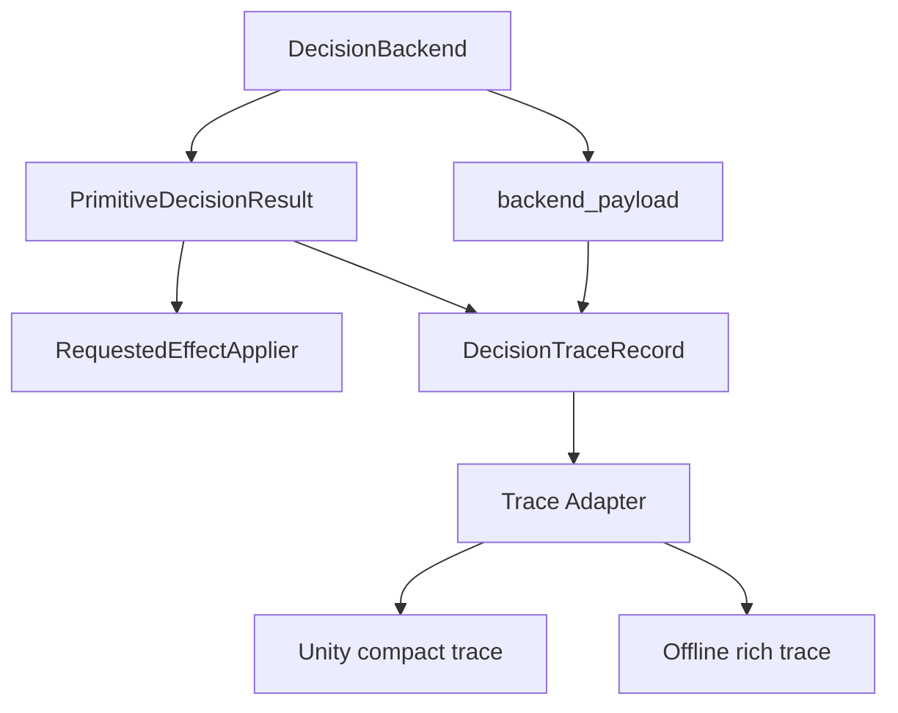

# V2.5 Decision Backend Design Sketch

This folder records the V2.5 design direction for primitive decision backends.
It is a design reference, not an implementation contract yet.

Primary files:

- `decision_backend_stage_design.md`: stage-level work map and decision index.
- `graph_contract_detail.md`: node and edge contract details for the core graph.
- `decision_trace_protocol.md`: trace schema and protocol sketch.
- `trace_service_detail.md`: Slice 1 trace service API and test design.
- `backend_payload_mapping_detail.md`: Slice 2 backend payload mapping design.
- `fallback_handoff_fact_audit_detail.md`: Slice 3 fallback/handoff fact audit.
- `behavior_tree_shadow_growth_detail.md`: Slice 4 BT shadow growth design.
- `backend_proposal_validation_detail.md`: Slice 5 backend proposal validation.
- `backend_registration_selection_detail.md`: Slice 6 backend registration and selection.
- `online_offline_eval_trace_integration_detail.md`: Slice 7 eval trace integration.
- `implementation_progress.md`: accepted implementation slices, planner audits,
  and reflection gates.
- `handoff.md`: compact current-state handoff for the next thread or planner
  slice.

## Design Edit Protocol

When the team changes its mind about a design point that is already written
down, do not append the new idea at the bottom of the file as a loose update.
Edit near the affected design point and add a local revision note directly
under that section.

Each revision note should include:

- date;
- discussion context that triggered the new idea;
- the new option or changed direction;
- why it was introduced;
- pros compared with the older version;
- cons or risks compared with the older version;
- whether it is accepted now, deferred, rejected, or still open.

Use this shape:

```text
Revision note, YYYY-MM-DD:
Context:
New option:
Why considered:
Pros versus previous version:
Cons versus previous version:
Current status:
```

During finalization, collapse open options into a final decision in the relevant
section. Keep only the historical revision notes that explain important tradeoff
decisions or rejected alternatives that future implementers are likely to
revisit.

## Current Decision

V2.5 should target a backend-neutral decision platform, not a behavior-tree-only
platform. Behavior Tree (BT) is useful as the first shadow backend because it
makes fallback order and selected paths explicit, but the shared contract must
also fit legacy FSM, VLM, learned, hybrid, and future external decision
backends.

The first stable design target is:

```text
DecisionBackend.decide_context(context)
  -> PrimitiveDecisionResult
  -> backend_payload

Report/trace owner
  PrimitiveDecisionResult + backend_payload + tick metadata
  -> DecisionTraceRecord
```

The existing `PrimitiveDecisionResult` and requested-effect contract remain the
runtime-facing decision result for V2.5. Do not introduce a first-class
`DecisionIntent` object in the first implementation slice.

## Intent Layer Status

`DecisionIntent` is a later option, not part of V2.5 v1.

The design should still use lightweight operation words in trace records, such
as `continue_current_skill`, `return_handoff`, `switch_skill`, `recover`, or
`validator_reject`. These are trace labels, not a new intermediate
representation.

Promote a formal `DecisionIntent` only if later evidence shows both conditions:

- two or more backend families need the same semantic intent vocabulary before
  requested effects are created;
- backend output needs a separate validator or mapper before it can safely
  become requested planner effects.

This is most likely for VLM or learned backends, where a semantic proposal may
need validation before planner mutation requests are allowed.

## Responsibility Boundaries

Decision backends own:

- choosing a decision result from typed decision context and facts;
- producing backend-specific explanation payloads;
- preserving the existing requested-effect contract.

Decision backends must not own:

- Unity eval I/O;
- offline replay file formats;
- rollout writer internals;
- planner mutable state ownership;
- token, coverage, return-handoff, or ACT action-dispatch ownership;
- generic trace export policy.

The consumer-neutral trace owner should live under the planner report/trace
boundary, not inside BT or any single backend. It should adapt decision results
and backend payloads into compact online traces and richer offline traces.

## Core Design Graph

The stage-level design expands from this graph:



Use `decision_backend_stage_design.md` as the owner of stage slices that expand
this graph. Use `graph_contract_detail.md` for node and edge contracts. Use
`decision_trace_protocol.md` for the trace schema and export protocol details.

## Backend Payload Rule

The generic trace schema must not require BT nodes, VLM prompt data, or legacy
FSM branch internals. Backend-specific details belong in a nested payload.

Examples:

- BT payload: root status, selected path, node outcomes, failed conditions.
- VLM payload: prompt id, evidence ids, answer summary, grounding, confidence,
  refusal or fallback reason.
- Legacy FSM payload: branch name, branch order index, legacy switch reason.

## Implementation Status

Slices 1 through 8a implemented the first backend-neutral infrastructure
sequence:

1. added a generic `DecisionTraceRecord` schema and focused tests under the
   planner report/trace owner;
2. adapted legacy FSM and BT shadow backend payloads into generic traces;
3. added compact/rich export helpers for online Unity eval and offline eval
   consumers without wiring consumer I/O;
4. added strict proposal validation, shadow fallback conversion, and validation
   trace projection;
5. locked production backend names to `("legacy_fsm",)` while allowing explicit
   `behavior_tree_shadow` test registration;
6. added the first real BT branch for return-completed transition.

## Non-Goals For V2.5 v1

- No user-facing production backend selector.
- No default behavior change from `legacy_fsm`.
- No formal `DecisionIntent` object.
- No generic blackboard.
- No direct Unity/offline export inside BT backend.
- No token, coverage, return-handoff, or action-dispatch ownership migration
  into decision backends.
