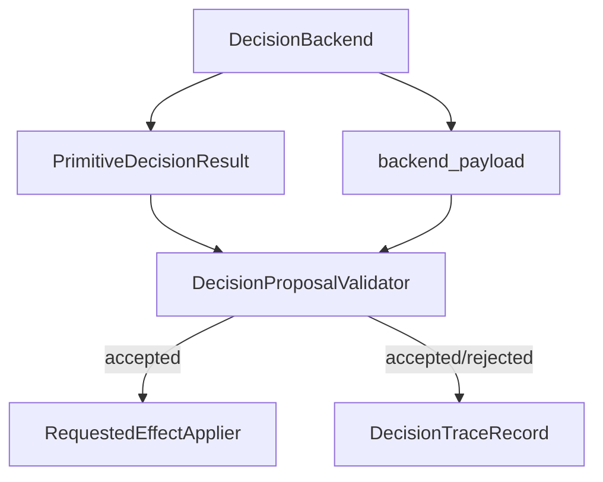

# Backend Proposal Validation Detail

This document details Slice 5: Backend Proposal Validation. It defines how
unsafe, incomplete, unsupported, or low-confidence backend outputs are rejected
before they can become planner effects.

This slice is required before VLM, learned, hybrid, or external backends can be
allowed to request planner mutations. It can also protect future BT branches.

## Scope

This design covers:

- validation after a backend proposes `PrimitiveDecisionResult`;
- validation trace fields and diagnostic checks;
- fail-closed behavior;
- how this differs from a future `DecisionIntent`;
- tests for unsafe proposal rejection.

This design does not cover:

- real VLM runtime;
- prompt design;
- model confidence calibration;
- backend selection or registration policy;
- changing default `legacy_fsm` behavior;
- replacing requested effects with a new intent object in v1.

## Position In The Core Graph

Validation sits between backend output and effect application:



The validator is not a new mutation path. It either accepts a result for the
existing requested-effect path or rejects it before any effect is applied.

Graph note:

- `DecisionProposalValidator` is a slice-local boundary on the existing
  `DecisionBackend -> PrimitiveDecisionResult -> RequestedEffectApplier` path;
- it should not be promoted into the durable core graph until implementation
  proves that multiple backend families need the same validator owner;
- if promoted later, update `decision_backend_stage_design.md` and
  `graph_contract_detail.md` near the graph, not at the bottom of either file.

## Validation Input

Recommended v1 input:

```text
backend_name: str
backend_kind: str
result: PrimitiveDecisionResult
backend_payload: object | None
context_summary: DecisionTraceMetadata | equivalent tick metadata
validation_mode: "strict" | "shadow_fallback"
```

The validator should not receive:

- planner objects;
- mutation ports;
- Unity transport handles;
- offline writer handles;
- raw image evidence;
- generic backend blackboard state.

## Validation Checks

### Result Contract Checks

Check:

- `decision_source` is non-empty and names the backend path;
- `status` is known;
- `skill_before` matches the tick context when available;
- `skill_after` is known when a skill switch is claimed;
- `switch_reason` is present when a switch requires one;
- `side_effects_applied` is only allowed for legacy compatibility paths;
- effects are a tuple of supported requested-effect objects.

### Effect Safety Checks

Check:

- effect types are supported by the requested-effect applier;
- effect order is deterministic;
- effect payloads are serializable or safely summarizable for trace;
- effect payloads do not carry callbacks or planner objects;
- no backend-specific payload is embedded into effect payloads.

### Backend-Specific Checks

For BT:

- root status is present;
- selected path is deterministic;
- a no-change fallback has explicit fallback reason;
- node trace entries are JSON-compatible.

For future VLM or external backends:

- confidence, if provided, is numeric and bounded;
- evidence ids are identifiers, not raw evidence blobs;
- proposed skill and effect are from allowed vocabularies;
- refusal or uncertainty maps to a fail-closed result;
- prompt/evidence metadata stays in `backend_payload`.

### Context Consistency Checks

Check:

- backend did not propose a switch from a skill different from
  `skill_before`;
- fallback result keeps `skill_before == skill_after`;
- proposed branch reason is compatible with active skill when known;
- missing optional facts produce `unknown` diagnostics, not fabricated facts.

## Fail-Closed Modes

### Strict Mode

Use for production default paths, unit tests, and contract tests.

Behavior:

- invalid proposals raise `PrimitiveDecisionContractError`;
- no requested effects are applied;
- trace assembly can record `trace_status == "contract_error"` when the caller
  owns a sidecar trace path.

Strict mode prevents a bad backend from silently continuing.

### Shadow Fallback Mode

Use only for explicit shadow/eval runs.

Behavior:

- invalid proposals are converted to a no-change fallback result;
- reason codes include `validator_rejected`;
- backend payload records the rejection summary;
- no requested effects from the rejected proposal are applied.

Shadow fallback mode keeps evaluation running while preserving evidence that
the backend was rejected.

### Unsupported Backend Name

Unsupported backend names are selection errors, not proposal rejections.

Behavior:

- raise `PrimitiveDecisionContractError`;
- do not silently fall back to `legacy_fsm`;
- list registered backend names in the error when possible.

## Trace Mapping

Recommended generic trace fields:

```text
trace_status: "success" | "fallback" | "contract_error" | "skipped"
validation_status: "accepted" | "rejected" | "skipped"
selected_operation: "validator_rejected_fallback" when shadow fallback is used
fallback_type: "validator_rejected" when shadow fallback is used
reason_codes: tuple including validator reason codes
diagnostic_checks: tuple[DecisionDiagnosticCheck, ...]
backend_payload.validation: validation summary
```

Slice 5c implementation note:

- `testbed/planner/primitive/report/decision_validation_trace.py` owns
  report-side projection from `DecisionProposalValidationResult` or
  `DecisionProposalShadowFallbackOutcome` into trace metadata, diagnostic
  checks, reason codes, and safe rich payload summaries;
- `testbed/planner/primitive/report/decision_trace.py` owns only the generic
  `validation_status` field and export pass-through;
- `testbed/planner/primitive/decision/validation.py` remains independent of
  report and trace modules.

Revision note, 2026-06-29:
Context: Slice 1 implementation locked the trace status vocabulary used by
`DecisionTraceRecord` and matched `decision_trace_protocol.md` plus
`trace_service_detail.md`.
New option: keep validator outcome in `validation_status`, reason codes, and
diagnostic checks instead of adding validator-specific `trace_status` values.
Why considered: trace status is generic record health/fallback state; validator
result is a decision-proposal diagnostic layered on top.
Pros versus previous version: avoids conflicting status vocabularies across
trace service and validation design.
Cons versus previous version: validation rejection needs one extra field or
diagnostic check instead of being encoded entirely in `trace_status`.
Status: accepted for Slice 5 design.

Recommended diagnostic check names:

```text
proposal_result_contract_valid
proposal_effect_types_supported
proposal_effect_payload_safe
proposal_context_consistent
proposal_confidence_acceptable
proposal_backend_payload_safe
```

Diagnostic statuses:

- `pass` when the check succeeds;
- `fail` when rejection is caused by that check;
- `skipped` when the check is irrelevant to the backend kind;
- `unknown` when the check cannot be evaluated from current facts.

## DecisionIntent Option

Current status: deferred.

V1 validates `PrimitiveDecisionResult` directly because that is the existing
runtime/effect contract.

Consider a first-class `DecisionIntent` later only if:

- at least two backend families need the same pre-effect proposal vocabulary;
- validators need to compare proposals before effects are created;
- VLM or learned backends need a structured way to express uncertain proposals;
- direct `PrimitiveDecisionResult` validation causes repeated adapter logic.

Do not introduce `DecisionIntent` only to make BT look cleaner.

## Test Contract

Validator tests should cover:

1. valid legacy FSM-style result is accepted;
2. valid BT no-change fallback is accepted;
3. unsupported effect type is rejected before effect application;
4. callback or planner-object payload is rejected;
5. context skill mismatch is rejected;
6. strict mode raises and applies no effects;
7. shadow fallback mode returns no-change with validator reason codes;
8. validation diagnostics map into `DecisionTraceRecord`;
9. backend payload rejection summary is present only in rich trace by default.

Candidate test files:

```text
tests/test_primitive_decision_proposal_validation.py
tests/test_primitive_decision_trace.py
tests/test_primitive_decision_runtime.py
```

## First Implementation Slice For This Detail

Preferred first implementation after trace parity and fallback/handoff audit:

1. implement a small validator that accepts existing valid results;
2. add strict rejection tests for effect and context contract violations;
3. add shadow fallback conversion for eval-only use;
4. map validation diagnostics into `DecisionTraceRecord`;
5. do not add `DecisionIntent` yet.

Allowed files are likely:

```text
testbed/planner/primitive/decision/contracts.py
testbed/planner/primitive/decision/validation.py
testbed/planner/primitive/report/decision_trace.py
tests/test_primitive_decision_proposal_validation.py
docs/v2_5_design_sketch/backend_proposal_validation_detail.md
```

Not allowed:

- real VLM runtime;
- prompt/model configuration;
- production backend selector change;
- bypassing requested effects;
- using validation as a second mutation path.
