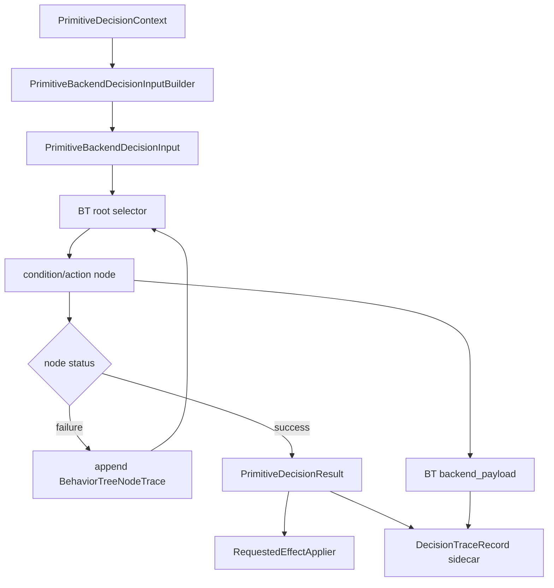

# Behavior Tree Shadow Growth Detail

This document details Slice 4: BT Shadow Branch Growth. It defines what a
behavior-tree tick does in this project, how BT nodes may grow from the current
shadow skeleton, and which gates must pass before any BT branch can request
planner effects.

This is not a plan to replace the production legacy FSM. It is a plan for
making a non-default BT backend explainable and safely testable.

## Scope

This design covers:

- the BT tick loop contract;
- node responsibility boundaries;
- backend payload produced by BT ticks;
- branch-growth gates;
- candidate branch order for later implementation;
- tests required before a BT branch can be trusted.

This design does not cover:

- changing the default backend from `legacy_fsm`;
- a complete BT rewrite of all legacy branches;
- a generic blackboard;
- real VLM, learned, or external backend behavior;
- moving return-handoff, coverage, token, policy, or action-dispatch mutable
  state into BT nodes.

## Current Shadow Baseline

Current non-default backend name:

```text
behavior_tree_shadow
```

Current code owner:

```text
testbed/planner/primitive/decision/backends/behavior_tree.py
```

Current shape:

- `BehaviorTreeDecisionBackend` builds `PrimitiveBackendDecisionInput` from
  `PrimitiveDecisionContext`;
- `BehaviorTreeSelectorNode` ticks child nodes in order;
- `ContinueCurrentSkillNode` returns a no-change `PrimitiveDecisionResult`;
- `BehaviorTreeDecisionOutcome` pairs the result with BT-specific node trace;
- `BehaviorTreeCompatibilityDecisionBackend` returns no compatibility decision;
- tests register the backend explicitly and prove it is not used by default.

Important current behavior:

- the continue fallback does not read transition facts;
- the root must return a valid result or raise a contract error;
- BT trace is backend-specific explanation data, not generic trace schema.

## BT Tick Loop

One BT decision tick should follow this sequence:

1. `BehaviorTreeDecisionBackend.decide_context_with_trace()` receives
   `PrimitiveDecisionContext`.
2. The backend uses `PrimitiveBackendDecisionInputBuilder` to build one typed,
   read-only input packet.
3. The root node ticks its children in deterministic priority order.
4. Each node reads only the typed facts it owns by contract.
5. A node either:
   - fails with a `BehaviorTreeNodeTrace`; or
   - succeeds with a `PrimitiveDecisionResult` plus node trace.
6. The first successful child selected by a selector becomes the decision.
7. The backend returns `PrimitiveDecisionResult` as the runtime result and BT
   node trace as `backend_payload`.
8. The requested-effect path applies mutations later through
   `RequestedEffectApplier`.
9. The report/trace owner assembles `DecisionTraceRecord` from the result,
   BT payload, and tick metadata.

Mermaid summary:



## Node Contract

Every BT node must have one stable responsibility.

Allowed:

- inspect `PrimitiveBackendDecisionInput`;
- read existing focused status objects lazily;
- return a `PrimitiveDecisionResult` through requested effects;
- return `BehaviorTreeNodeTrace` with node name, status, and reason;
- fail without mutation.

Forbidden:

- mutating planner state directly;
- calling planner methods;
- owning Unity or offline eval I/O;
- storing planner-private state across ticks;
- copying coverage, token, policy, ACT action, or handoff mutable state into a
  BT-local blackboard;
- hiding branch-order changes inside trace-only work.

Node names should describe stable branch semantics, for example:

```text
continue_current_skill
return_completed_transition
dump_ready_to_return
carry_ready_to_dump
dig_ready_to_carry
```

Avoid names tied to a run, date, experiment, bug, or temporary observation.

## Payload Contract

BT payload should be nested under `DecisionTraceRecord.backend_payload`.

Recommended payload shape:

```text
backend_kind: "behavior_tree"
root_status: "success" | "failure"
selected_path: tuple[str, ...]
node_trace: tuple[BehaviorTreeNodeTrace, ...]
fallback_selected: bool
reason_codes: tuple[str, ...]
```

Compact Unity trace should not include the full `node_trace` by default.
Offline rich trace may include it.

BT payload must not contain:

- planner objects;
- callbacks;
- mutation ports;
- non-serializable runtime references;
- large observations or image evidence.

## Branch Growth Gates

A new BT branch is allowed only when all gates pass:

1. Facts gate: required facts are available through
   `PrimitiveBackendFactsAccess`, `PrimitiveDecisionFacts`, or focused status
   records.
2. Effect gate: the intended planner mutation is already represented by an
   approved requested-effect contract.
3. Trace gate: success, failure, and fallback can be explained through generic
   trace fields plus BT backend payload.
4. Parity gate: default `legacy_fsm` behavior remains unchanged.
5. Failure gate: branch failure returns node trace and lets the selector try a
   later child.
6. Fallback gate: the root still has an explicit safe fallback.
7. Ownership gate: no new mutable runtime state is introduced inside BT.

If any gate fails, the branch stays as design only.

## Candidate Branch Order

### Candidate 0: Continue Current Skill

Status: existing shadow skeleton.

Meaning:

- return no requested effects;
- preserve skill before/after;
- emit explicit BT continue fallback payload.

This branch is useful because it proves the BT tick loop, payload shape, and
non-default registration without touching production behavior.

### Candidate 1: Return Completed Transition

Status: implemented as the first real shadow BT branch in Slice 8a.

Reason:

- return-to-next-skill handoff is central to fallback/handoff diagnosis;
- `ReturnTransitionStatus` already exposes summarized transition facts such as
  `completed_transition`, `next_skill`, and `switch_reason`;
- the branch can be tested with synthetic status objects before touching live
  rollout behavior.

Required before implementation:

- confirm the existing requested effect that represents the transition;
- confirm legacy branch order and bookkeeping remain unchanged;
- add trace diagnostics for the pass/fail path.

Implementation facts:

- `ReturnCompletedTransitionNode` runs before `ContinueCurrentSkillNode`;
- non-return skills fail this node without reading return transition facts;
- return skill reads `ReturnTransitionStatus` lazily and fails to the continue
  fallback when `completed_transition` is false;
- completed return status requests only approved return-transition effects:
  `CompleteReturnTransitionEffect`,
  `SwitchToNextSkillAfterReturnEffect`, and
  `MarkReturnNextDigEventSeenEffect` when `next_dig_event` is true;
- the node derives the return reason suffix in the legacy order:
  `next_or_seen_dig_event and handoff_ready`, then
  `direct_handoff_ready`, then `shallow_guard_allowed`;
- the branch is covered through explicit `behavior_tree_shadow` runtime
  selection, strict proposal validation, generic trace assembly, and compact
  online / rich offline trace export.

### Candidate 2: Dump Ready To Return

Status: later candidate.

Reason:

- `DumpTransitionStatus` exposes `ready_to_return`,
  `coverage_completion_reason`, and `dump_to_return_reason`;
- the branch is a clear skill handoff decision.

Risk:

- dump completion can interact with coverage bookkeeping, so it should follow
  trace and diagnostic mapping work.

### Candidate 3: Carry Ready To Dump

Status: later candidate.

Reason:

- `CarryTransitionStatus` exposes `ready_to_dump`,
  `carry_to_dump_reason`, and dump-ready hold state.

Risk:

- carry/dump readiness may depend on mass and deposit semantics that should
  stay with focused capability owners.

### Candidate 4: Dig Ready To Carry Or Dig Recovery

Status: later candidate.

Reason:

- dig has rich recovery and terminal-stop behavior;
- it is useful but higher risk than return/dump/carry handoff branches.

Risk:

- branch order, bad-replan counters, exit guards, and coverage rejection must
  remain parity-locked.

## Test Contract

BT growth tests should cover:

1. root selector preserves deterministic child order;
2. failed child nodes append failure trace and do not mutate planner state;
3. first successful child result becomes the runtime result;
4. continue fallback remains available when earlier children fail;
5. new branch reads only the facts it declares;
6. new branch returns only approved requested effects;
7. BT backend payload maps into `DecisionTraceRecord.backend_payload`;
8. `legacy_fsm` remains the default without explicit selector override.

Candidate test files:

```text
tests/test_primitive_behavior_tree_backend.py
tests/test_primitive_decision_trace.py
tests/test_primitive_decision_runtime.py
```

## Implemented First Slice For This Detail

The first implementation sequence after trace service, payload mapping, and
fallback/handoff diagnostic mapping is now complete:

1. added report-side mapping from BT node traces to generic `backend_payload`;
2. added tests proving compact trace summarizes BT without full node lists;
3. added tests proving rich trace includes BT node trace safely;
4. locked validator and explicit backend-selection tests before any real BT
   branch could request effects;
5. added one real BT branch for return-completed transition using existing
   facts and approved requested effects.

Allowed files are likely:

```text
testbed/planner/primitive/decision/backends/behavior_tree.py
testbed/planner/primitive/report/decision_trace.py
tests/test_primitive_behavior_tree_backend.py
tests/test_primitive_decision_trace.py
docs/v2_5_design_sketch/behavior_tree_shadow_growth_detail.md
```

Not allowed:

- production default change;
- complete BT rewrite;
- generic blackboard;
- direct planner mutation from BT nodes;
- Unity/offline eval I/O in BT modules;
- real VLM or learned backend behavior.
