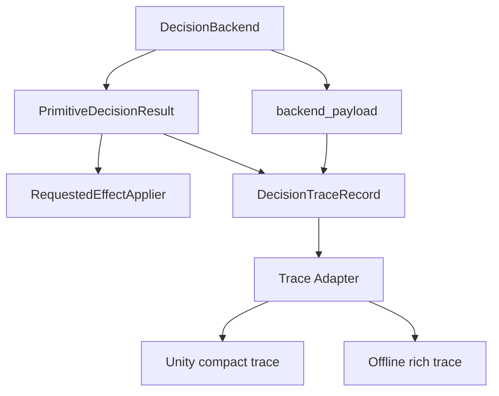

# V2.5 Decision Backend Stage Design

This file is the stage-level design map for V2.5 decision-backend work. The
structure follows the core graph below. Every slice should strengthen one node
or edge in the graph. If a future idea needs a new node, record the reason as a
local design revision before implementing it.

Use the edit protocol in `README.md` when changing decisions in this file:
record changed ideas near the affected section with date, context, pros, cons,
and current status.

## Stage Objective

V2.5 should make primitive planner decisions observable, backend-neutral, and
safe to extend beyond the current legacy FSM path.

The goal is not to replace the production planner immediately. The goal is to
create enough shared decision infrastructure that legacy FSM, BT shadow, future
VLM, learned, hybrid, or external backends can be compared through the same
facts, result/effect boundary, and trace/export surface.

## Core Design Graph

All V2.5 work expands from this graph:

## Graph Responsibilities

### DecisionBackend

Role: choose a decision result from typed decision context and facts.

Owned by: primitive decision backend modules.

V2.5 rules:

- backend output must preserve the requested-effect contract;
- BT is only one backend family, not the shared abstraction;
- VLM, learned, hybrid, and external backends must be able to fit without
  pretending to be BT nodes;
- backend modules do not own Unity I/O, offline replay files, rollout writers,
  or planner mutable-state ownership.

### DecisionBackend -> PrimitiveDecisionResult

Role: runtime decision path.

This edge returns the existing runtime-facing result. It is the stable contract
that says whether the skill changed, why it changed, and which requested
effects are being returned.

V2.5 rules:

- keep `PrimitiveDecisionResult` and requested effects as the v1 runtime
  contract;
- do not add a first-class `DecisionIntent` in the first implementation slice;
- do not change default production behavior from `legacy_fsm`.

### PrimitiveDecisionResult -> RequestedEffectApplier

Role: planner mutation path.

This is the only path that applies planner state changes. Trace data must not
become a second mutation route.

V2.5 rules:

- no trace adapter may mutate planner state;
- no backend-specific payload may call planner methods or hold mutation ports;
- requested-effect validation remains the boundary for allowed planner
  mutations.

### DecisionBackend -> backend_payload

Role: backend-specific explanation output.

This edge lets each backend explain what it did without owning the generic
trace schema. BT can emit node paths, VLM can emit prompt/evidence metadata,
and legacy FSM can emit branch details.

V2.5 rules:

- backend payloads must be behavior-neutral explanation data;
- backend payloads must not hold mutation ports, callbacks, planner objects, or
  eval I/O handles;
- backend payloads must be JSON-compatible or exportable through a safe summary
  layer.

### PrimitiveDecisionResult + backend_payload -> DecisionTraceRecord

Role: sidecar generic trace assembly.

The planner report/trace owner combines runtime result fields, backend payload,
and optional tick metadata into a consumer-neutral `DecisionTraceRecord`.

V2.5 rules:

- generic trace assembly belongs under the planner report/trace owner;
- trace additions must be behavior-neutral;
- trace records should serve both online Unity eval and offline eval;
- generic trace schema changes must not force every backend to know eval/report
  export details.

### DecisionTraceRecord backend_payload

Role: nested backend-specific explanation inside the generic trace record.

This field is the escape hatch for details that are useful to one backend
family but should not pollute the generic trace schema.

Examples:

- BT: root status, selected path, node outcomes, failed conditions.
- VLM: prompt id, evidence ids, answer summary, grounding, confidence.
- Legacy FSM: branch name, branch order index, legacy switch reason.

V2.5 rules:

- BT node paths do not belong in the generic trace core;
- VLM prompt/evidence data does not belong in the generic trace core;
- backend payloads must remain JSON-compatible or exportable through a safe
  summary layer.

### DecisionTraceRecord -> Trace Adapter

Role: export boundary.

This edge converts the generic trace record into consumer-facing forms without
making the backend own eval I/O.

V2.5 rules:

- trace adapter owns compact/rich export shape;
- backend modules do not own online Unity transport or offline file formats;
- export helpers should be deterministic and easy to test.

### Trace Adapter -> Unity Compact Trace

Role: low-overhead online evaluation trace.

Unity-facing compact traces should be small, stable, and per-tick friendly.

V2.5 rules:

- no nested BT node lists by default;
- no visual evidence payloads or large arrays;
- include backend name, status, skill before/after, selected operation, reason
  codes, effect summary, confidence if available, and tick time if available.

### Trace Adapter -> Offline Rich Trace

Role: replay, parity, mismatch, and aggregate-analysis trace.

Offline rich traces can include backend payloads and diagnostic checks because
they are used after the run for deeper analysis.

V2.5 rules:

- rich trace may include backend payload;
- offline eval owns persistence and report layout;
- the backend layer must not force a concrete file format.

## Work Slices By Graph Area

### Slice 1: Generic Decision Trace Service

Graph area:

- `DecisionBackend -> backend_payload`
- `PrimitiveDecisionResult + backend_payload -> DecisionTraceRecord`
- `DecisionTraceRecord -> Trace Adapter`
- `Trace Adapter -> Unity compact trace`
- `Trace Adapter -> Offline rich trace`

Purpose: define the consumer-neutral trace record and sidecar assembly path.

Deliverables:

- `DecisionTraceRecord` schema under the planner report/trace owner.
- effect summary and diagnostic-check summary helpers.
- sidecar assembler from `PrimitiveDecisionResult`, backend payload, and tick
  metadata.
- compact export for online Unity eval.
- rich export for offline eval.
- focused tests that build traces from existing decision results without
  changing planner behavior.

Reference: `decision_trace_protocol.md`.

Non-goals:

- no backend selector;
- no production default change;
- no Unity socket or offline replay writer integration;
- no formal `DecisionIntent`.

### Slice 2: Trace Adoption Parity

Graph area:

- `DecisionBackend -> backend_payload`
- `PrimitiveDecisionResult + backend_payload -> DecisionTraceRecord`
- `DecisionTraceRecord backend_payload`

Purpose: prove the trace service can describe both current production-style
decisions and shadow backend decisions.

Reference: `backend_payload_mapping_detail.md`.

Deliverables:

- legacy FSM trace adapter or payload mapping;
- BT shadow trace payload mapping;
- tests that compare compact/rich record shape across legacy FSM and
  `behavior_tree_shadow`;
- documentation of any field that cannot be populated from one backend.

Non-goals:

- no change to branch order, switch reasons, or active skill transitions;
- no production routing to BT.

### Slice 3: Fallback And Handoff Fact Audit

Graph area:

- `DecisionBackend -> PrimitiveDecisionResult`
- `DecisionBackend -> backend_payload`
- `PrimitiveDecisionResult + backend_payload -> DecisionTraceRecord`
- `DecisionTraceRecord backend_payload`

Purpose: identify the smallest typed facts needed to explain fallback and
handoff decisions without creating a generic blackboard.

Reference: `fallback_handoff_fact_audit_detail.md`.

Deliverables:

- audit of which fallback/handoff reasons are already expressible through
  existing facts, effects, and trace fields;
- list of missing facts, each assigned to its focused owner;
- tests for any newly exposed facts.

Non-goals:

- no new handoff algorithm;
- no migration of return-handoff mutable state into a decision backend;
- no copied token, coverage, or policy-private state.

### Slice 4: BT Shadow Branch Growth

Graph area:

- `DecisionBackend -> PrimitiveDecisionResult`
- `DecisionBackend -> backend_payload`
- `PrimitiveDecisionResult + backend_payload -> DecisionTraceRecord`
- `DecisionTraceRecord backend_payload`

Purpose: add real BT decision nodes only after the trace and facts boundary can
explain what each node did.

Reference: `behavior_tree_shadow_growth_detail.md`.

Deliverables:

- one BT branch at a time, backed by existing typed facts and requested effects;
- node payload mapped into generic trace records;
- parity tests proving default production behavior remains unchanged.

Candidate first branches:

- continue-current-skill fallback, already present in the shadow skeleton;
- one handoff or skill-switch branch whose facts and requested effects are
  already focused and testable.

Non-goals:

- no complete BT rewrite;
- no default backend change;
- no generic blackboard.

### Slice 5: Backend Proposal Validation

Graph area:

- `DecisionBackend -> PrimitiveDecisionResult`
- `DecisionBackend -> backend_payload`
- `PrimitiveDecisionResult + backend_payload -> DecisionTraceRecord`

Purpose: define how unsafe, incomplete, or low-confidence backend proposals fail
closed before they become planner effects.

This slice is most relevant for VLM, learned, hybrid, or external backends. It
is also the earliest point where a first-class `DecisionIntent` object may be
reconsidered.

Reference: `backend_proposal_validation_detail.md`.

Deliverables:

- validator boundary for backend proposals;
- trace fields for validator rejection and fail-closed outcomes;
- mock backend tests for unsafe proposal rejection.

Non-goals:

- no real VLM runtime requirement;
- no model/prompt configuration;
- no production selector.

### Slice 6: Backend Selection And Registration

Graph area:

- `DecisionBackend`

Purpose: decide when and how a non-default backend can be selected by a harness,
eval path, or production runtime.

Reference: `backend_registration_selection_detail.md`.

Deliverables:

- explicit registration policy;
- config or harness selector design;
- fail-closed behavior for unsupported backend names;
- tests proving `legacy_fsm` remains the default unless explicitly overridden.

Non-goals:

- no silent default change;
- no experimental backend promoted to production without trace and validation
  evidence.

### Slice 7: Online And Offline Eval Integration

Graph area:

- `DecisionTraceRecord -> Trace Adapter`
- `Trace Adapter -> Unity compact trace`
- `Trace Adapter -> Offline rich trace`

Purpose: connect compact and rich trace exports to the eval owners after the
trace record is stable.

Reference: `online_offline_eval_trace_integration_detail.md`.

Deliverables:

- online Unity eval compact trace consumption path;
- offline eval rich trace persistence or report path;
- replay or mismatch-diagnosis checks that use the generic trace fields.

Non-goals:

- no direct eval I/O inside BT or other backend modules;
- no backend-owned file format.

## Execution Order

1. Stabilize the trace side of the graph: `DecisionTraceRecord`,
   `Trace Adapter`, compact export, rich export.
2. Prove trace parity for `legacy_fsm` and `behavior_tree_shadow`.
3. Audit missing fallback and handoff facts only after trace shows what cannot
   be explained.
4. Add proposal validation before any VLM, learned, hybrid, or external backend
   can request planner effects.
5. Add backend selection only after trace, facts, and validation are proven.
6. Integrate online/offline eval through their own owners, not through backend
   modules.
7. Grow BT branches one at a time, only where facts, requested effects, trace,
   validation, and selector rules are already focused.

Revision note, 2026-06-29:
Context: after writing the Slice 4-7 details in one pass, BT growth was
rechecked against trace, validator, backend-selection, and eval-integration
dependencies.
New option: move real BT branch growth after validation, explicit selection,
and trace integration readiness.
Why considered: a larger BT before shared trace and validation would make
backend comparison harder and could hide unsafe proposals behind node logic.
Pros versus previous version: stronger fail-closed behavior, clearer eval
evidence, and less risk that BT-specific shape becomes the shared abstraction.
Cons versus previous version: real BT branch implementation starts later.
Status: accepted for the first V2.5 implementation plan.

## Coding Readiness Order

When this design moves from sketch to implementation, the first coding plan
should follow this order:

1. implement trace-side records and adapters only;
2. add legacy FSM and BT shadow payload mapping;
3. map fallback/handoff diagnostics from existing facts;
4. add validator shell in strict mode, then shadow fallback mode;
5. lock explicit backend registration/selection tests;
6. connect offline rich trace before online compact transport;
7. grow one BT branch only after the above tests pass.

Do not start with BT branch expansion. A larger BT without shared trace,
validation, and selector rules would make backend comparison harder, not easier.

## Stage Completion Criteria

The V2.5 stage is ready to leave design/prototype mode when:

- `DecisionBackend -> backend_payload` works for legacy FSM and BT shadow;
- `PrimitiveDecisionResult + backend_payload -> DecisionTraceRecord` works
  through the report/trace owner;
- `DecisionBackend -> PrimitiveDecisionResult` remains behavior-preserving for
  the default production path;
- `PrimitiveDecisionResult -> RequestedEffectApplier` remains the only mutation
  path;
- `Trace Adapter -> Unity compact trace` works without backend-specific imports;
- `Trace Adapter -> Offline rich trace` supports replay or mismatch diagnosis;
- `DecisionTraceRecord backend_payload` can carry backend-specific details
  without leaking them into the generic core;
- fallback and handoff reasons are explainable through typed facts, requested
  effects, and trace fields;
- at least one non-default backend path is testable without changing the
  production default;
- future VLM or learned backends have a clear validation boundary before they
  can request planner effects.

## Open Options

### First-class DecisionIntent

Current status: deferred.

Consider introducing it only after trace parity and proposal-validation work
show that multiple backend families need the same semantic proposal vocabulary
before requested effects are created.

Pros:

- separates "what the backend wants" from "what planner effects are allowed";
- useful for VLM and learned backend validation;
- can make fallback and validator rejection easier to diagnose.

Cons:

- premature until at least two backend families need it;
- may duplicate `PrimitiveDecisionResult` and requested effects;
- adds a new contract to test and maintain.

### Trace Inside PrimitiveDecisionResult

Current status: deferred.

The current design keeps trace sidecar-owned by the report/trace boundary.
Consider moving trace into `PrimitiveDecisionResult` only if the sidecar path
loses result/trace association or creates excessive plumbing.

Pros:

- impossible to lose trace/result association;
- simpler call return shape for some backends.

Cons:

- expands the runtime/effect contract early;
- forces all decision callers to understand trace shape;
- risks coupling eval/report concerns to planner mutation semantics.
