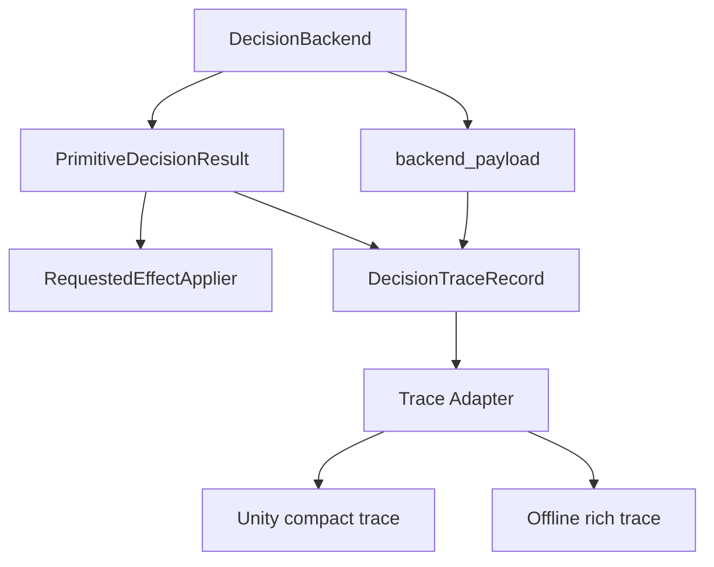

# Core Graph Contract Detail

This document defines the node and edge contracts for the V2.5 decision-backend
core graph.

## Contract Principles

- Runtime mutation and trace observation are separate paths.
- `PrimitiveDecisionResult` remains the runtime/effect contract.
- `DecisionTraceRecord` is assembled by the report/trace owner as sidecar data.
- Backends may produce backend-specific payloads, but they do not own generic
  trace schema or eval export policy.
- Only `RequestedEffectApplier` may apply planner state mutations.
- Online Unity eval and offline eval consume exported trace dictionaries, not
  backend internals.

## Node Contracts

### DecisionBackend

Owner: `testbed/planner/primitive/decision/backends/**`.

Role: choose a primitive decision from `PrimitiveDecisionContext` and typed facts.

Inputs:

- `PrimitiveDecisionContext`;
- typed backend input/facts built from current planner state;
- backend-local construction ports.

Outputs:

- `PrimitiveDecisionResult`;
- optional backend-specific payload for trace assembly.

Allowed:

- inspect typed decision facts;
- choose no-change, skill switch, handoff, recovery, or fail-closed result
  through existing requested-effect contracts;
- produce backend-specific explanation payloads.

Forbidden:

- mutate planner state directly;
- own Unity eval or offline eval I/O;
- write replay files;
- call planner methods through payloads;
- copy token, coverage, return-handoff, policy, or ACT action-dispatch state
  into a backend-owned blackboard.

### PrimitiveDecisionResult

Owner: existing primitive decision contract module.

Role: runtime-facing decision/effect result.

Required meaning:

- `decision_source` names the backend or compatibility path;
- `status` describes runtime decision status such as no-change or skill switch;
- `skill_before`, `skill_after`, and `switch_reason` preserve observable
  planner decision outcomes;
- `effects` carries already-applied legacy effects or requested planner effects;
- `side_effects_applied` distinguishes legacy compatibility outcomes from pure
  requested-effect results.

Allowed:

- remain minimal and runtime-focused;
- continue to validate requested effects.

Forbidden in V2.5 v1:

- embedding `DecisionTraceRecord`;
- embedding BT node trace, VLM prompt metadata, or offline replay payloads;
- becoming a generic proposal or intent object.

### backend_payload

Owner: producing backend, interpreted by report/trace owner.

Role: backend-specific explanation data.

Required shape:

- JSON-compatible, or convertible to a safe summary;
- backend-kind specific;
- behavior-neutral.

Examples:

- BT payload: root status, selected path, node outcomes, failed conditions.
- VLM payload: prompt id, evidence ids, answer summary, grounding, confidence,
  refusal or fallback reason.
- Legacy FSM payload: branch name, branch order index, legacy reason,
  side-effect mode.

Forbidden:

- callbacks;
- planner objects;
- mutation ports;
- large arrays by default;
- private mutable state references;
- Unity transport handles;
- offline writer handles.

### RequestedEffectApplier

Owner: existing primitive requested-effect runtime.

Role: apply requested planner mutations through explicit shell ports.

Inputs:

- observation for effect application;
- ordered `RequestedPlannerEffect` tuple from `PrimitiveDecisionResult`.

Outputs:

- planner state mutations through allowed ports.

Contract:

- this is the only mutation path in the graph;
- trace fields and backend payloads must not bypass it;
- unsupported effect types fail through existing contract errors.

### DecisionTraceRecord

Owner: planner report/trace package.

Role: backend-neutral sidecar record for decision explanation and eval.

Inputs:

- `PrimitiveDecisionResult`;
- backend payload;
- tick metadata, when available.

Outputs:

- generic trace record consumed by trace adapters.

Required properties:

- stable schema version;
- backend-neutral core fields;
- nested backend payload;
- no direct mutation capability;
- compact and rich export compatibility.

Core fields are defined in `decision_trace_protocol.md`.

### Trace Adapter

Owner: planner report/trace package, with eval-specific consumption owned by
eval modules.

Role: convert `DecisionTraceRecord` into consumer-facing dictionaries.

Inputs:

- `DecisionTraceRecord`;
- export mode selection: compact or rich.

Outputs:

- compact online dict for Unity eval;
- rich offline dict for replay and mismatch diagnosis.

Forbidden:

- planner state mutation;
- backend selection;
- direct backend-specific imports unless they are isolated in payload
  summarizers;
- forcing a single offline file format.

### Unity compact trace

Owner: online Unity eval consumer.

Role: low-overhead per-tick live trace.

Expected fields:

- schema version;
- backend name and kind;
- decision source;
- decision and trace status;
- skill before and after;
- selected operation;
- fallback type;
- reason codes;
- requested-effect summary;
- confidence, when available;
- tick id or sim time, when available.

Forbidden:

- full BT node lists by default;
- raw visual evidence;
- large arrays;
- backend-private mutable state.

### Offline rich trace

Owner: offline eval or replay consumer.

Role: replay, parity, mismatch, and aggregate-analysis trace.

Expected fields:

- all compact fields;
- switch reason;
- diagnostic checks;
- effect summaries with safe payload summaries;
- episode id, when available;
- backend payload.

Forbidden:

- requiring backend modules to choose a file format;
- storing callbacks, planner objects, mutation ports, or non-serializable
  runtime references.

## Edge Contracts

### DecisionBackend -> PrimitiveDecisionResult

Meaning: backend chooses a runtime decision result.

Must preserve:

- requested-effect validation;
- legacy compatibility distinction;
- default production behavior unless an explicit selector decision changes it.

Must not:

- smuggle trace-only fields into effect payloads;
- rely on eval consumers to make planner decisions;
- change branch order or switch reasons during trace-only work.

### DecisionBackend -> backend_payload

Meaning: backend emits explanation data for trace assembly.

Must preserve:

- behavior neutrality;
- backend-local semantics;
- safe conversion to generic trace payload.

Must not:

- duplicate generic trace fields unnecessarily;
- own compact/rich export policy;
- contain planner mutation handles.

### PrimitiveDecisionResult + backend_payload -> DecisionTraceRecord

Meaning: report/trace owner assembles the generic decision trace.

Must preserve:

- stable mapping from runtime result to trace status;
- association between result, payload, and tick metadata;
- backend-neutral core fields.

Must not:

- mutate planner state;
- require a backend to import eval exporters;
- force every backend to produce every optional field.

### PrimitiveDecisionResult -> RequestedEffectApplier

Meaning: requested effects become planner mutations through explicit shell ports.

Must preserve:

- effect ordering;
- contract errors for unsupported effects;
- separation from trace/export data.

Must not:

- use `DecisionTraceRecord` as input;
- use backend payload as mutation data unless it has already been converted into
  a validated requested effect.

### DecisionTraceRecord -> Trace Adapter

Meaning: generic trace becomes exportable data.

Must preserve:

- compact/rich mode separation;
- stable schema version;
- backend payload nesting.

Must not:

- perform backend decisions;
- call effect appliers;
- select production backends.

### Trace Adapter -> Unity compact trace

Meaning: export low-overhead online trace.

Must preserve:

- small per-tick payload;
- stable field names;
- no backend-specific imports for Unity consumers.

### Trace Adapter -> Offline rich trace

Meaning: export replayable diagnostic trace.

Must preserve:

- enough detail for parity and mismatch diagnosis;
- backend payload access;
- JSON-compatible output.

## First Implementation Contract

The first implementation slice should implement only the trace-side contracts:

1. `DecisionTraceRecord` schema.
2. effect and diagnostic summary records.
3. sidecar assembler from `PrimitiveDecisionResult`, backend payload, and
   metadata.
4. compact and rich export helpers.
5. focused tests over synthetic `PrimitiveDecisionResult` and payload examples.

It must not:

- change default backend selection;
- add a first-class `DecisionIntent`;
- change planner branch order;
- add Unity socket I/O;
- add offline writer integration;
- move token, coverage, return-handoff, or ACT action ownership.

## Later Options

### Formal DecisionIntent

Current status: deferred.

Reconsider only when multiple backend families need a shared semantic proposal
layer before requested effects are created, or when proposal validation cannot
remain clear with trace labels plus requested effects.

### Trace Embedded In PrimitiveDecisionResult

Current status: deferred.

Reconsider only if sidecar assembly loses result/payload association or creates
excessive plumbing. The default V2.5 v1 contract keeps trace sidecar-owned.
